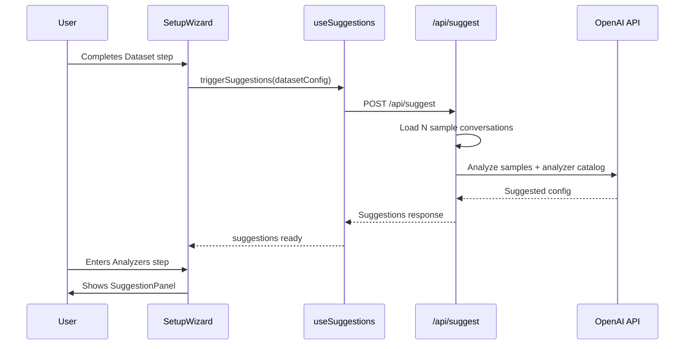

# AI Smart Suggestions for Analyze Wizard

## Architecture Overview



## Backend Changes

### 1. New Suggestion Endpoint in `serve.py`

Add `POST /api/suggest` endpoint:

- **Input**: `{ dataset_path?, dataset_name?, split?, sample_count: 5 }`
- **Process**:

  1. Load first N conversations from dataset
  2. Build prompt with: sample conversations, available analyzers catalog, test types
  3. Call OpenAI API (gpt-4o-mini for cost efficiency)
  4. Parse structured response

- **Output**:

```json
{
  "analyzers": [
    { "id": "length", "reason": "Your conversations vary significantly in length" },
    { "id": "usefulness", "reason": "Contains Q&A pairs that could benefit from usefulness scoring" }
  ],
  "custom_metrics": [
    { "id": "topic_classifier", "function": "...", "reason": "Detected multiple topic categories" }
  ],
  "tests": [
    { "id": "max_length", "type": "threshold", "metric": "LengthAnalyzer.total_tokens", "operator": "<", "value": 4096, "reason": "Ensure conversations fit context windows" }
  ]
}
```

### 2. New Suggestion Module: `src/oumi/analyze/suggest.py`

Create a dedicated module for suggestion logic:

- `get_analyzer_catalog()` - Returns structured info about all available analyzers
- `build_suggestion_prompt(conversations, catalog)` - Constructs the LLM prompt
- `parse_suggestion_response(response)` - Validates and structures the LLM output
- `generate_suggestions(dataset_path, dataset_name, split, sample_count)` - Main entry point

Key prompt design:

- Provide analyzer descriptions and what metrics they produce
- Include test type examples (threshold, percentage, range)
- Show 3-5 sample conversations (truncated if long)
- Ask for JSON-structured response with reasoning

## Frontend Changes

### 3. New Hook: `src/oumi/analyze/web/src/hooks/useSuggestions.ts`

```typescript
interface Suggestion {
  analyzers: Array<{ id: string; reason: string; params?: Record<string, unknown> }>
  customMetrics: Array<{ id: string; function: string; outputSchema: Array<...>; reason: string }>
  tests: Array<{ id: string; type: string; metric: string; ...; reason: string }>
}

export function useSuggestions() {
  // State: idle | loading | success | error
  // triggerSuggestions(datasetConfig) - starts fetch
  // suggestions - the result
  // appliedSuggestions - track which ones user applied
}
```

### 4. New Component: `SuggestionPanel.tsx`

A collapsible panel component:

- **Header**: "AI Suggestions" with collapse toggle and loading indicator
- **Body**:
  - Grouped sections: Analyzers, Custom Metrics, Tests
  - Each suggestion shows name, reason, and "Apply" button
  - "Apply All" button at bottom
  - Checkmarks on already-applied suggestions
- **States**: loading (shimmer), ready (suggestions), empty (no suggestions), error

Design:

- Collapsed by default if user dismisses
- Subtle accent color border (not overwhelming)
- Sparkle/wand icon to indicate AI-powered

### 5. Integration in `SetupWizard.tsx`

- **On Dataset step "Next"**: Call `triggerSuggestions()` with dataset config
- **In Analyzers step**: Render `<SuggestionPanel type="analyzers" />` above the grid
- **In Tests step**: Render `<SuggestionPanel type="tests" />` above the test list
- **Apply handlers**:
  - `applyAnalyzerSuggestion(id, params)` - adds analyzer with suggested params
  - `applyTestSuggestion(test)` - adds test with suggested config
  - `applyAllSuggestions()` - applies all unapplied suggestions

## Key Files to Modify

| File | Changes |

|------|---------|

| [serve.py](src/oumi/analyze/serve.py) | Add `/api/suggest` endpoint |

| **New**: `suggest.py` | LLM suggestion logic |

| **New**: `useSuggestions.ts` | React hook for suggestions |

| **New**: `SuggestionPanel.tsx` | UI component |

| [SetupWizard.tsx](src/oumi/analyze/web/src/components/wizard/SetupWizard.tsx) | Integrate panel + trigger |

## LLM Prompt Strategy

The prompt will include:

1. **System context**: "You are an assistant that recommends data quality analyzers..."
2. **Analyzer catalog**: List of available analyzers with descriptions and metrics
3. **Test types**: Examples of threshold, percentage, range tests
4. **Sample data**: 3-5 truncated conversations from the dataset
5. **Output format**: Strict JSON schema for parsing

Example analyzer catalog entry:

```
- length: Computes token/word/character counts. Metrics: total_tokens, total_words, total_chars, num_messages. Good for: detecting overly long/short conversations.
- usefulness: LLM-based evaluation of response helpfulness. Metrics: score (0-100), passed, label, reasoning. Good for: Q&A datasets, chatbot training data.
```

## Error Handling

- **API key missing**: Show "Configure OpenAI API key to enable suggestions"
- **Rate limit**: Graceful degradation, user can still configure manually
- **Parse error**: Log and show "Couldn't generate suggestions, please configure manually"
- **Network error**: Retry with backoff, then show error state
