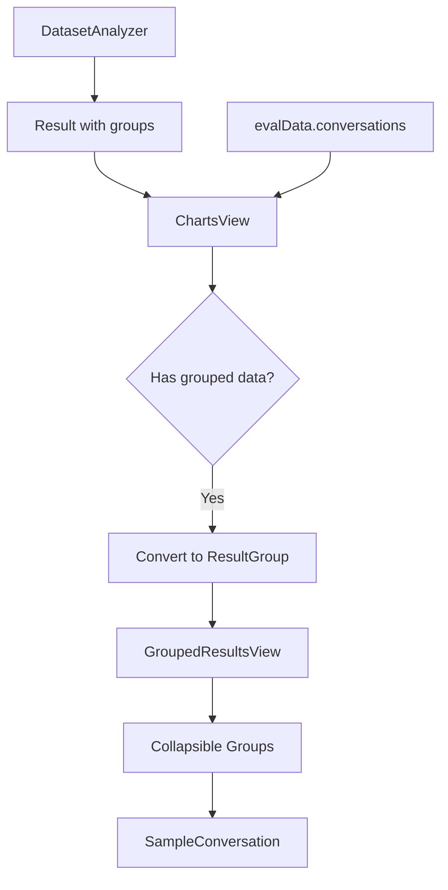

# Grouped Results Review UI

## Problem

Dataset-level analyzers often produce grouped/categorized results where users want to:

1. See the distribution of groups (counts, percentages)
2. Drill down into specific groups to inspect actual conversations

## Analyzers That Fit This Pattern

| Analyzer | Groups By | Drill-down Shows |

|----------|-----------|------------------|

| **Duplicates** | Content hash | Identical/similar conversations |

| **Language Distribution** | Detected language | Conversations in that language |

| **System Prompt Inconsistency** | Unique system prompts | Conversations using each prompt |

| **Output Format Inconsistency** | Detected format (JSON, markdown, plain) | Conversations with that format |

| **Distribution Skew / Label Imbalance** | Label/category/task type | Conversations in each category |

| **Problem Misalignment** | Issue type (off-topic, edge case) | Flagged conversations |

## Design

### Generalized Data Structure

```tsx
// Generic group that any dataset analyzer can produce
interface ResultGroup {
  name: string              // "Group 1", "English", "JSON format", etc.
  indices: number[]         // Conversation indices in this group
  count: number             // Size of group (= indices.length)
  percentage?: number       // Optional: % of total dataset
  sample_text?: string      // Preview text from first conversation
  metadata?: Record<string, unknown>  // Extra info (similarity, severity, etc.)
}
```

### UI Layout

```
┌─────────────────────────────────────────────────────────────┐
│ Summary Cards (existing)                                    │
│ ┌─────────┐ ┌─────────┐ ┌─────────┐ ┌─────────┐           │
│ │ Total   │ │ Unique  │ │ Dups    │ │ Groups  │           │
│ │ 120     │ │ 103     │ │ 17      │ │ 6       │           │
│ └─────────┘ └─────────┘ └─────────┘ └─────────┘           │
├─────────────────────────────────────────────────────────────┤
│ ▼ Grouped Results (6 groups)                                │
│                                                             │
│ ┌─────────────────────────────────────────────────────────┐│
│ │ Group 1                                    5 items (4%) ││
│ │ "How do I reset my password? I need to..."              ││
│ │ [▶ View Conversations]                                  ││
│ │                                                         ││
│ │ ┌─ Expanded conversation view ─────────────────────────┐││
│ │ │ Sample 1 (index 12)  [Keep]                         │││
│ │ │ [User] How do I reset my password?                  │││
│ │ │ [Assistant] You can reset your password by...       │││
│ │ ├─────────────────────────────────────────────────────┤││
│ │ │ Sample 2 (index 34)  [Duplicate]                    │││
│ │ │ [User] How do I reset my password?                  │││
│ │ │ [Assistant] You can reset your password by...       │││
│ │ └─────────────────────────────────────────────────────┘││
│ └─────────────────────────────────────────────────────────┘│
│ ┌─────────────────────────────────────────────────────────┐│
│ │ Group 2                                    3 items (2%) ││
│ │ ...                                                     ││
│ └─────────────────────────────────────────────────────────┘│
└─────────────────────────────────────────────────────────────┘
```

## Implementation

### 1. Add Types to eval.ts

File: `src/oumi/analyze/web/src/types/eval.ts`

```tsx
// Generic group structure for dataset-level analyzers
export interface ResultGroup {
  name: string
  indices: number[]
  count: number
  percentage?: number
  sample_text?: string | null
  metadata?: Record<string, unknown>
}
```

### 2. Create GroupedResultsView Component

New file: `src/oumi/analyze/web/src/components/charts/GroupedResultsView.tsx`

```tsx
interface GroupedResultsViewProps {
  title: string                    // "Duplicate Groups", "Language Distribution"
  groups: ResultGroup[]
  conversations: Conversation[]
  emptyMessage?: string            // "No groups found"
  showPercentages?: boolean        // Show % next to counts
  sortBy?: 'count' | 'name'        // Default sort order
  // For duplicates: mark first index as "keep", rest as "duplicate"
  markFirstAsKeep?: boolean
}
```

Features:

- Collapsible section with group count in header
- Each group shows: name, count, percentage, sample text preview
- "View Conversations" button expands to show actual conversations
- Uses existing `SampleConversation` component for conversation display
- Sorted by count (largest first) by default
- Optional badges for deduplication (Keep/Duplicate)

### 3. Update ChartsView

Modify: `src/oumi/analyze/web/src/components/charts/ChartsView.tsx`

- Detect when viewing an analyzer with `duplicate_groups` or similar grouped data
- Convert analyzer-specific groups to generic `ResultGroup[]` format
- Render `GroupedResultsView` below the summary cards
- Pass conversations from `evalData.conversations`

Conversion for deduplication:

```tsx
const groups: ResultGroup[] = deduplicationResult.duplicate_groups.map((g, i) => ({
  name: `Group ${i + 1}`,
  indices: g.indices,
  count: g.indices.length,
  percentage: (g.indices.length / total) * 100,
  sample_text: g.sample_text,
  metadata: { similarity: g.similarity }
}))
```

## Data Flow



## Future Extensibility

When building new dataset analyzers, they can easily integrate by:

1. Including a `groups` field in their result model:

```python
class LanguageDistributionResult(BaseModel):
    groups: list[LanguageGroup]  # Each has indices, language_code, count
```

1. ChartsView detects the groups and converts to `ResultGroup[]`
2. Reuses the same `GroupedResultsView` component

This pattern will work for:

- Language detection → groups by language
- System prompt analysis → groups by unique system prompt
- Output format detection → groups by format type
- Label distribution → groups by label/category
- Topic clustering → groups by detected topic
