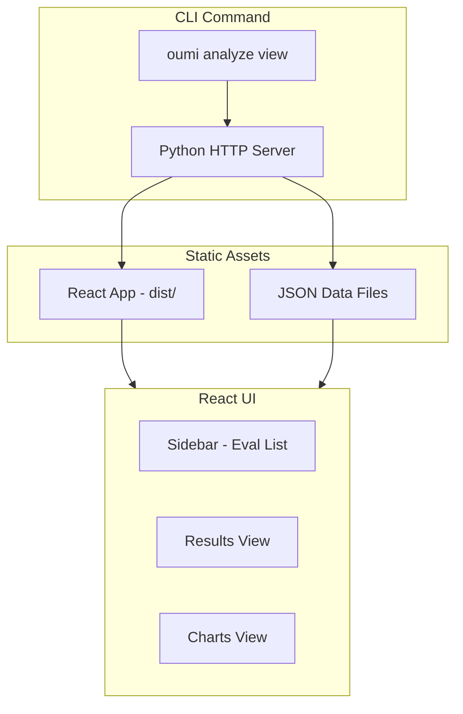

# React/Vite Analyze UI

## Architecture



## Data Flow (Embedded Approach)

Instead of a REST API, the React app reads JSON files directly:

1. CLI runs analysis, saves results to `~/.oumi/analyze/evals/{id}.json`
2. CLI generates `index.json` listing all evals
3. `oumi analyze view` serves static React app + JSON files via Python HTTP server
4. React app fetches `/data/index.json` and `/data/evals/{id}.json` as needed

## Tech Stack

| Layer | Technology |

|-------|------------|

| Build | Vite + TypeScript |

| UI Framework | React 18 |

| Components | shadcn/ui (Radix primitives) |

| Styling | Tailwind CSS |

| Charts | Recharts (lighter than Plotly) |

| Icons | lucide-react |

| State | React Query (for data fetching/caching) |

## Project Structure

```
src/oumi/analyze/
├── ui/                          # Keep existing Streamlit (deprecated)
├── web/                         # New React app
│   ├── package.json
│   ├── vite.config.ts
│   ├── tailwind.config.js
│   ├── components.json          # shadcn config
│   ├── src/
│   │   ├── main.tsx
│   │   ├── App.tsx
│   │   ├── index.css            # Tailwind imports
│   │   ├── lib/
│   │   │   └── utils.ts         # cn() helper
│   │   ├── hooks/
│   │   │   └── useEvals.ts      # Data fetching hooks
│   │   ├── types/
│   │   │   └── eval.ts          # TypeScript types matching Python models
│   │   ├── components/
│   │   │   ├── ui/              # shadcn components
│   │   │   ├── layout/
│   │   │   │   ├── Sidebar.tsx
│   │   │   │   └── Header.tsx
│   │   │   ├── results/
│   │   │   │   ├── TestCard.tsx
│   │   │   │   ├── TestSummary.tsx
│   │   │   │   ├── SampleConversation.tsx
│   │   │   │   └── ResultsView.tsx
│   │   │   └── charts/
│   │   │       ├── ScoreDistribution.tsx
│   │   │       ├── PassRateChart.tsx
│   │   │       └── ChartsView.tsx
│   │   └── pages/
│   │       ├── Dashboard.tsx
│   │       └── EvalDetail.tsx
│   └── dist/                    # Built output (gitignored)
└── serve.py                     # Python HTTP server for CLI
```

## Phase 1: MVP Implementation

### 1.1 Project Setup

Create Vite + React + TypeScript project with:

- Tailwind CSS configuration
- shadcn/ui initialization
- Base components: Button, Card, Badge, Tabs, ScrollArea, Tooltip

### 1.2 TypeScript Types

Mirror Python Pydantic models:

```typescript
// types/eval.ts
interface EvalMetadata {
  id: string;
  name: string;
  created_at: string;
  sample_count: number;
  pass_rate: number | null;
  analyzer_count: number;
  test_count: number;
  tests_passed: number;
  tests_failed: number;
}

interface EvalData {
  metadata: EvalMetadata;
  config: Record<string, unknown>;
  analysis_results: Record<string, AnalysisResult[]>;
  test_results: TestResults;
  conversations: Conversation[];
}

interface TestResult {
  test_id: string;
  passed: boolean;
  severity: "low" | "medium" | "high";
  metric: string;
  affected_count: number;
  total_count: number;
  // ... etc
}
```

### 1.3 Data Layer

```typescript
// hooks/useEvals.ts
- useEvalList(): Fetch index.json, return list of EvalMetadata
- useEval(id: string): Fetch specific eval JSON
- Data is cached via React Query
```

### 1.4 Layout Components

**Sidebar** (`components/layout/Sidebar.tsx`):

- Eval list with search/filter
- Quick stats for selected eval
- Styled similar to existing (pass rate badges, timestamps)

**Header** (`components/layout/Header.tsx`):

- Eval name and metadata
- Tab navigation (Results | Charts)

### 1.5 Results View

**TestSummary** - Pass rate card, passed/failed counts, severity breakdown

**TestCard** - Individual test with:

- Pass/fail indicator
- Severity badge
- Metric, threshold, affected count
- Expandable sample conversations

**SampleConversation** - Chat-style message display with:

- Role icons (user/assistant/system)
- Truncation with "Show more"
- Metadata accordion

### 1.6 Charts View

**ScoreDistribution** - Histogram per analyzer using Recharts

**PassRateChart** - Bar chart of pass rates by analyzer

### 1.7 Python Server Integration

Update `src/oumi/cli/analyze.py`:

```python
@app.command("view")
def view_command():
    # 1. Copy JSON files to temp serving directory
    # 2. Serve React dist/ + JSON via http.server
    # 3. Open browser to localhost:port
```

## Phase 2: Future Additions (Not in MVP)

- Config Editor (YAML with syntax highlighting via Monaco)
- Setup Wizard (multi-step form)
- Export functionality
- Delete/rename evals

## Key Files to Modify

| File | Change |

|------|--------|

| `src/oumi/cli/analyze.py` | Update `view` command to serve React app |

| `src/oumi/analyze/storage.py` | Add method to export JSON for web consumption |

| `pyproject.toml` | Add React build to package data |

## Build and Deployment

1. React app built during package build (or pre-built and committed)
2. `dist/` folder included in Python package
3. CLI serves from package resources

```python
# In cli/analyze.py
from importlib.resources import files
web_dist = files("oumi.analyze.web") / "dist"
```
