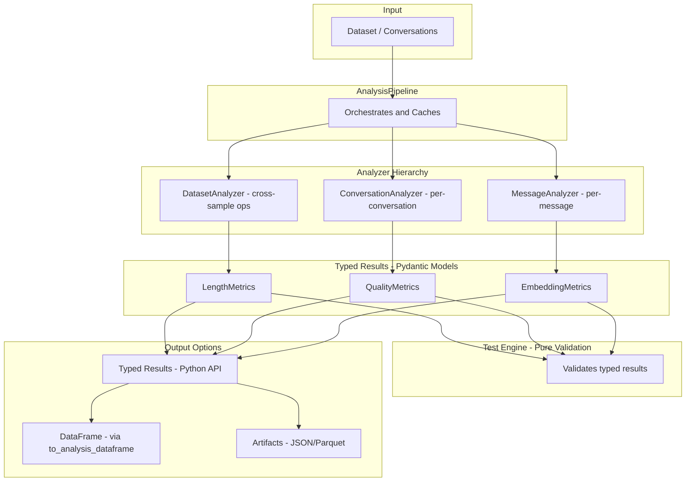

# Analyze Architecture Refactor

## Overview

Combined refactor that addresses two issues:

1. **DataFrame complexity** - Replace with typed Conversation objects and Pydantic results
2. **Metrics/tests mixing** - Clean separation of computation from validation

## Why This Refactor?

### Current Pain Points

```python
# Current: Confusing DataFrame-centric API
df = pd.DataFrame([{'text_content': 'Hello world'}])
schema = {'text_content': {'content_type': ContentType.TEXT}}
result_df, generated_schema = analyzer.analyze_sample(df, schema)
assert 'text_content_length_word_count' in result_df.columns  # Hope it exists
```

```python
# Proposed: Clean, typed API
result = analyzer.analyze("Hello world")
assert result.total_word_count == 2  # IDE autocomplete, type checking
```

### Benefits of New Architecture

- **Type safety**: Pydantic models give IDE autocomplete, validation, clear contracts
- **Testability**: Simple input → output, no DataFrame gymnastics
- **Clear mental model**: Analyzers return typed results, not mutated DataFrames
- **Separation of concerns**: Metrics compute, tests validate

## New Architecture



## Analyzer Hierarchy

### Base Classes

```python
from abc import ABC, abstractmethod
from typing import Generic, TypeVar
from pydantic import BaseModel

TResult = TypeVar('TResult', bound=BaseModel)

class MessageAnalyzer(ABC, Generic[TResult]):
    """Analyzes individual messages."""

    @abstractmethod
    def analyze(self, message: Message) -> TResult:
        """Analyze a single message."""
        ...

    def analyze_batch(self, messages: list[Message]) -> list[TResult]:
        """Analyze multiple messages. Override for vectorized impl."""
        return [self.analyze(m) for m in messages]

    def __call__(self, message: Message) -> TResult:
        return self.analyze(message)


class ConversationAnalyzer(ABC, Generic[TResult]):
    """Analyzes complete conversations."""

    @abstractmethod
    def analyze(self, conversation: Conversation) -> TResult:
        """Analyze a single conversation."""
        ...

    def analyze_batch(self, conversations: list[Conversation]) -> list[TResult]:
        """Analyze multiple conversations. Override for batched impl."""
        return [self.analyze(c) for c in conversations]


class DatasetAnalyzer(ABC, Generic[TResult]):
    """Analyzes entire dataset (cross-sample operations like deduplication)."""

    @abstractmethod
    def analyze(self, conversations: list[Conversation]) -> TResult:
        """Analyze full dataset. Has access to all conversations."""
        ...


class PreferenceAnalyzer(ABC, Generic[TResult]):
    """Analyzes preference pairs (for DPO data)."""

    @abstractmethod
    def analyze(self, chosen: Conversation, rejected: Conversation) -> TResult:
        """Analyze a preference pair."""
        ...
```

### Scope Selection

| Scope | Class | Use Case | Example |

|-------|-------|----------|---------|

| Message | `MessageAnalyzer` | Per-message metrics | Length, format detection |

| Conversation | `ConversationAnalyzer` | Per-conversation metrics | Turn patterns, coherence |

| Dataset | `DatasetAnalyzer` | Cross-sample operations | Deduplication, clustering |

| Preference | `PreferenceAnalyzer` | DPO pair analysis | Preference margin |

## Typed Result Models

```python
from pydantic import BaseModel

class LengthMetrics(BaseModel):
    """Results from LengthAnalyzer."""
    total_chars: int
    total_words: int
    total_tokens: int | None = None
    avg_message_length: float
    message_lengths: list[int]  # Per-message breakdown


class QualityMetrics(BaseModel):
    """Results from QualityAnalyzer."""
    has_pii: bool
    pii_count: int
    pii_types: list[str]
    has_encoding_issues: bool
    repetition_ratio: float


class EmbeddingMetrics(BaseModel):
    """Results from EmbeddingAnalyzer (dataset-level)."""
    has_duplicate: bool
    duplicate_group_id: int | None
    nearest_neighbor_similarity: float
    cluster_id: int | None


class LLMJudgeMetrics(BaseModel):
    """Results from LLMJudgeAnalyzer."""
    score: float
    label: str
    reasoning: str
    raw_response: str
```

## Example Analyzer Implementation

```python
class LengthAnalyzer(ConversationAnalyzer[LengthMetrics]):
    """Analyzes text length metrics for conversations."""

    def __init__(self, count_tokens: bool = False, tokenizer: str | None = None):
        self.count_tokens = count_tokens
        self.tokenizer = self._load_tokenizer(tokenizer) if count_tokens else None

    def analyze(self, conversation: Conversation) -> LengthMetrics:
        message_lengths = []
        total_chars = 0
        total_words = 0

        for message in conversation.messages:
            text = message.content if isinstance(message.content, str) else ""
            chars = len(text)
            words = len(text.split())
            message_lengths.append(words)
            total_chars += chars
            total_words += words

        return LengthMetrics(
            total_chars=total_chars,
            total_words=total_words,
            total_tokens=self._count_tokens(conversation) if self.count_tokens else None,
            avg_message_length=total_words / len(conversation.messages) if conversation.messages else 0,
            message_lengths=message_lengths,
        )

    # Optional: text-only convenience method
    def analyze_text(self, text: str) -> LengthMetrics:
        """Analyze a single text string."""
        return LengthMetrics(
            total_chars=len(text),
            total_words=len(text.split()),
            total_tokens=len(self.tokenizer.encode(text)) if self.tokenizer else None,
            avg_message_length=len(text.split()),
            message_lengths=[len(text.split())],
        )
```

## AnalysisPipeline

```python
class AnalysisPipeline:
    """Orchestrates multiple analyzers and manages caching."""

    def __init__(
        self,
        analyzers: list[MessageAnalyzer | ConversationAnalyzer | DatasetAnalyzer],
        cache_dir: str | Path | None = None,
    ):
        self.analyzers = analyzers
        self.cache_dir = cache_dir
        self._results_cache: dict[str, list[BaseModel]] = {}

    def run(self, conversations: list[Conversation]) -> dict[str, list[BaseModel]]:
        """Run all analyzers and return results keyed by analyzer name."""
        results = {}

        for analyzer in self.analyzers:
            name = analyzer.__class__.__name__

            if isinstance(analyzer, DatasetAnalyzer):
                # Dataset-level: single result for entire dataset
                results[name] = analyzer.analyze(conversations)
            elif isinstance(analyzer, ConversationAnalyzer):
                # Conversation-level: one result per conversation
                results[name] = analyzer.analyze_batch(conversations)
            elif isinstance(analyzer, MessageAnalyzer):
                # Message-level: flatten all messages
                all_messages = [m for c in conversations for m in c.messages]
                results[name] = analyzer.analyze_batch(all_messages)

        self._results_cache = results
        return results

    def to_dataframe(self) -> pd.DataFrame:
        """Convert cached results to DataFrame."""
        return to_analysis_dataframe(self._results_cache)
```

## Usage Examples

### Python API (Clean and Typed)

```python
from oumi.analyze import LengthAnalyzer, QualityAnalyzer, AnalysisPipeline

# Single conversation analysis
analyzer = LengthAnalyzer()
result = analyzer.analyze(conversation)
print(f"Total words: {result.total_words}")  # IDE autocomplete!
print(f"Avg length: {result.avg_message_length}")

# Batch processing
results = analyzer.analyze_batch(conversations)
for r in results:
    if r.total_words > 1000:
        print("Long conversation detected")

# Full pipeline
pipeline = AnalysisPipeline(
    analyzers=[
        LengthAnalyzer(count_tokens=True),
        QualityAnalyzer(detect_pii=True),
    ],
)
all_results = pipeline.run(conversations)

# DataFrame when needed for analysis/visualization
df = pipeline.to_dataframe()
df[df['LengthMetrics.total_words'] > 100].plot()
```

### Config-Driven (YAML)

```yaml
# analyzers.yaml
analyzers:
  - id: length
    params:
      count_tokens: true
      tokenizer: gpt-4o

  - id: quality
    params:
      detect_pii: true
      detect_encoding_issues: true

  - id: embedding  # Dataset-level analyzer
    params:
      model: all-MiniLM-L6-v2
      detect_duplicates: true
      duplicate_threshold: 0.95

custom_metrics:
  - id: turn_pattern
    scope: conversation
    function: |
      def compute(conversation: Conversation) -> dict:
          roles = [m.role for m in conversation.messages]
          alternating = all(roles[i] != roles[i+1] for i in range(len(roles)-1))
          return {"has_alternating_turns": alternating}

tests:
  # Pure validation - operates on typed results
  - id: no_pii
    metric: QualityMetrics.has_pii
    condition: "== False"
    max_percentage: 1.0
    severity: high

  - id: reasonable_length
    metric: LengthMetrics.total_words
    operator: "<"
    value: 10000
    max_percentage: 5.0
```

## Test Engine (Pure Validation)

Tests operate on typed results - no computation, just assertions:

```python
class TestEngine:
    """Validates analysis results against configured tests."""

    def run_tests(
        self,
        results: dict[str, list[BaseModel]],
        tests: list[TestConfig],
    ) -> TestSummary:
        """Run all tests against typed results."""
        for test in tests:
            # Parse metric path: "QualityMetrics.has_pii"
            analyzer_name, field_name = test.metric.split(".")
            analyzer_results = results[analyzer_name]

            # Extract field values from typed results
            values = [getattr(r, field_name) for r in analyzer_results]

            # Run validation
            result = self._evaluate_test(test, values)
            ...
```

## DataFrame Bridge

For users who need DataFrames for analysis/visualization:

```python
def to_analysis_dataframe(
    conversations: list[Conversation],
    results: dict[str, list[BaseModel]],
) -> pd.DataFrame:
    """Convert typed analysis results to a DataFrame.

    Each analyzer's result fields become columns with prefix:
    - LengthMetrics.total_words -> "length__total_words"
    - QualityMetrics.has_pii -> "quality__has_pii"
    """
    rows = []
    for i, conv in enumerate(conversations):
        row = {"conversation_id": conv.id, "conversation_index": i}

        for analyzer_name, analyzer_results in results.items():
            if i < len(analyzer_results):
                result = analyzer_results[i]
                prefix = analyzer_name.replace("Metrics", "").lower()
                for field_name, value in result.model_dump().items():
                    row[f"{prefix}__{field_name}"] = value

        rows.append(row)

    return pd.DataFrame(rows)
```

## Custom Metrics

User-defined metrics that return typed results:

```yaml
custom_metrics:
  - id: language_consistency
    scope: conversation
    result_schema:
      is_consistent: bool
      user_language: str
      assistant_language: str
    function: |
      def compute(conversation: Conversation) -> dict:
          # Detect languages for user vs assistant messages
          user_langs = detect_languages([m for m in conversation.messages if m.role == "user"])
          asst_langs = detect_languages([m for m in conversation.messages if m.role == "assistant"])
          return {
              "is_consistent": user_langs[0] == asst_langs[0],
              "user_language": user_langs[0],
              "assistant_language": asst_langs[0],
          }
```

## Migration Strategy

1. **LengthAnalyzer** (only one in main branch) - refactor as proof of concept
2. **New base classes** - implement the hierarchy
3. **AnalysisPipeline** - implement orchestration
4. **Adapter for old API** - `SampleAnalyzer` adapter for gradual migration
5. **CLI update** - use new architecture internally
6. **Documentation** - migration guide for any external users

## Key Design Decisions

| Decision | Choice | Rationale |

|----------|--------|-----------|

| Return type | Pydantic models | Type safety, validation, serialization |

| DataFrame | Output format only | Use for analysis/viz, not processing |

| Analyzer hierarchy | Message/Conversation/Dataset | Clear scope, each gets appropriate context |

| Custom metrics | Inline Python in config | Simple cases without full class |

| Tests | Pure validation | Operate on existing results, no computation |

| Batching | `analyze_batch()` method | Explicit, can be vectorized |

## File Structure

```
src/oumi/analyze/
├── __init__.py           # Public API exports
├── base.py               # Base analyzer classes
├── pipeline.py           # AnalysisPipeline
├── results/              # Pydantic result models
│   ├── __init__.py
│   ├── length.py         # LengthMetrics
│   ├── quality.py        # QualityMetrics
│   └── ...
├── analyzers/            # Analyzer implementations
│   ├── __init__.py
│   ├── length.py         # LengthAnalyzer
│   ├── quality.py        # QualityAnalyzer
│   ├── embedding.py      # EmbeddingAnalyzer (DatasetAnalyzer)
│   └── ...
├── testing/              # Test engine
│   ├── __init__.py
│   ├── engine.py         # TestEngine
│   └── runners.py        # Test type runners
└── utils/
    ├── __init__.py
    └── dataframe.py      # to_analysis_dataframe()
```
