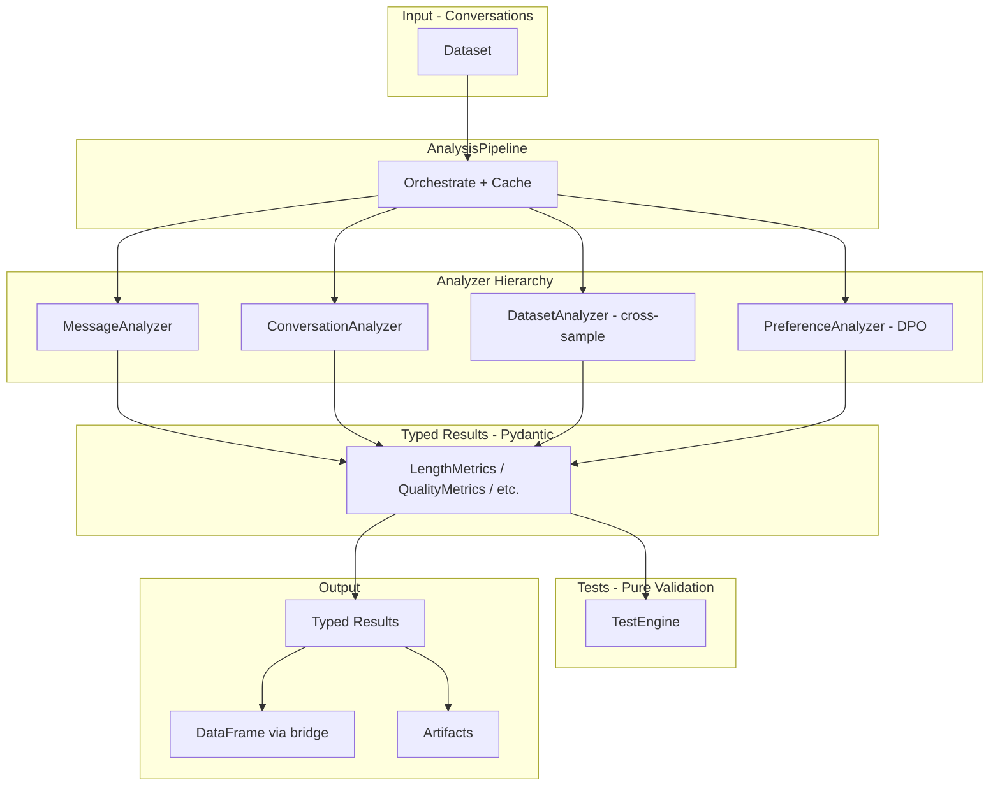

# Typed Analyzer Architecture

## Goals

1. Replace DataFrame-centric API with typed Conversation objects and Pydantic results
2. Clear analyzer hierarchy by scope (Message, Conversation, Dataset, Preference)
3. Separate metrics (computed, cached) from tests (pure validation)
4. Start with conversations + preferences, extensible for other types later

## Architecture Overview



## Base Analyzer Classes

**File:** `src/oumi/analyze/base.py`

```python
class MessageAnalyzer(ABC, Generic[TResult]):
    def analyze(self, message: Message) -> TResult: ...
    def analyze_batch(self, messages: list[Message]) -> list[TResult]: ...

class ConversationAnalyzer(ABC, Generic[TResult]):
    def analyze(self, conversation: Conversation) -> TResult: ...
    def analyze_batch(self, conversations: list[Conversation]) -> list[TResult]: ...

class DatasetAnalyzer(ABC, Generic[TResult]):
    """Cross-sample operations (deduplication, clustering)."""
    def analyze(self, conversations: list[Conversation]) -> TResult: ...

class PreferenceAnalyzer(ABC, Generic[TResult]):
    """For DPO preference pairs."""
    def analyze(self, chosen: Conversation, rejected: Conversation) -> TResult: ...
```

## Typed Result Models

**File:** `src/oumi/analyze/results/length.py`

```python
class LengthMetrics(BaseModel):
    total_chars: int
    total_words: int
    total_tokens: int | None = None
    avg_message_length: float
    message_lengths: list[int]
```

## Example Implementation

**File:** `src/oumi/analyze/analyzers/length.py`

```python
class LengthAnalyzer(ConversationAnalyzer[LengthMetrics]):
    def analyze(self, conversation: Conversation) -> LengthMetrics:
        lengths = [len(m.content.split()) for m in conversation.messages]
        return LengthMetrics(
            total_chars=sum(len(m.content) for m in conversation.messages),
            total_words=sum(lengths),
            avg_message_length=sum(lengths) / len(lengths) if lengths else 0,
            message_lengths=lengths,
        )
```

## AnalysisPipeline

**File:** `src/oumi/analyze/pipeline.py`

```python
class AnalysisPipeline:
    def __init__(self, analyzers: list, cache_dir: Path | None = None): ...
    def run(self, conversations: list[Conversation]) -> dict[str, list[BaseModel]]: ...
    def to_dataframe(self) -> pd.DataFrame: ...
```

## DataFrame Bridge

**File:** `src/oumi/analyze/utils/dataframe.py`

```python
def to_analysis_dataframe(
    conversations: list[Conversation],
    results: dict[str, list[BaseModel]],
) -> pd.DataFrame:
    """Convert typed results to DataFrame when needed for analysis/viz."""
```

## Tests (Pure Validation)

Tests operate on typed results - no computation:

```yaml
tests:
  - id: no_pii
    metric: QualityMetrics.has_pii  # Access typed field
    condition: "== False"
    max_percentage: 1.0
```

## File Structure

```
src/oumi/analyze/
├── __init__.py           # Public API
├── base.py               # Base analyzer classes
├── pipeline.py           # AnalysisPipeline
├── results/              # Pydantic models
│   ├── length.py
│   └── quality.py
├── analyzers/            # Implementations
│   ├── length.py
│   └── quality.py
├── testing/              # Test engine
│   └── engine.py
└── utils/
    └── dataframe.py      # to_analysis_dataframe()
```

## Extensibility

When other dataset types are needed later:

- Add `TextAnalyzer` base class for pretraining
- Add `KTOAnalyzer` for KTO datasets
- Pipeline auto-detects and routes to appropriate analyzers

## Migration

1. Only `LengthAnalyzer` exists in main - refactor as proof of concept
2. Build new architecture in `src/oumi/analyze/`
3. Update CLI to use new pipeline
4. Deprecate old `SampleAnalyzer` approach
