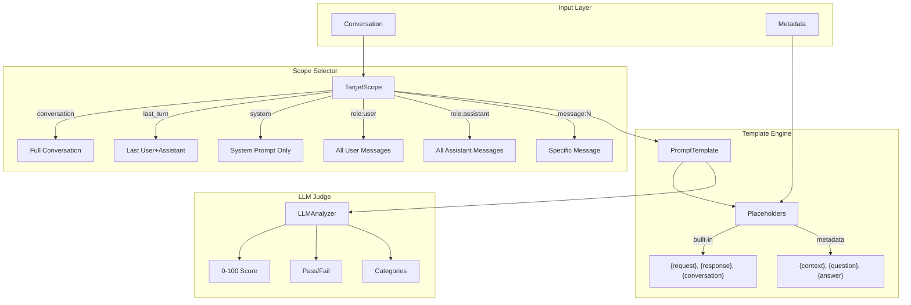
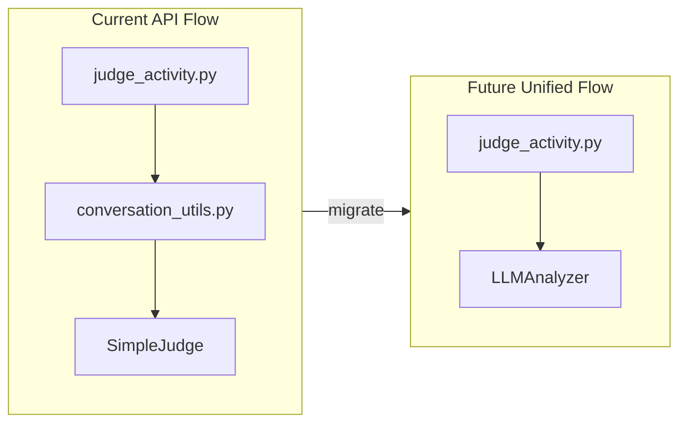

# Unified LLM Analyzer Framework

## Goal

Create a unified LLM-as-judge framework that combines:

- The **typed analyzer** architecture (standardized results, caching, tests)
- The **API judge** flexibility (templates, metadata placeholders, judgment types)
- **New scope targeting** (evaluate specific messages, roles, or full conversations)

## Architecture Overview



## Key Changes

### 1. Add Scope/Target System

New `TargetScope` enum and extraction logic in [src/oumi/analyze/analyzers/llm_analyzer.py](src/oumi/analyze/analyzers/llm_analyzer.py):

```python
class TargetScope(str, Enum):
    CONVERSATION = "conversation"      # Full conversation (multi-turn)
    LAST_TURN = "last_turn"            # Last user + assistant exchange (single-turn)
    SYSTEM = "system"                  # System prompt only
    USER_MESSAGES = "role:user"        # All user messages
    ASSISTANT_MESSAGES = "role:assistant"  # All assistant messages
    FIRST_USER = "first_user"          # First user message (prompt difficulty)
    LAST_ASSISTANT = "last_assistant"  # Last assistant response
```

#### API Compatibility: Single-Turn vs Multi-Turn Mapping

The API judge workflow currently has two modes that `TargetScope` subsumes:

| API Mode | TargetScope Equivalent | Behavior |

|----------|------------------------|----------|

| Single-turn (`is_multiturn=False`) | `last_turn` | Extracts last user msg as `{request}`, last assistant as `{response}` |

| Multi-turn (`is_multiturn=True`) | `conversation` | Full conversation with turn tags as `{conversation}` |

**Multi-turn formatting options** (matching API's `conv_to_dict_format_multiturn`):

```python
class LLMAnalyzer:
    def __init__(
        self,
        target_scope: TargetScope = TargetScope.CONVERSATION,
        # Multi-turn formatting options (only for CONVERSATION scope)
        turn_indexing: bool = False,        # Add turn numbers: <user-0>, <user-1>
        user_turn_tag: str = "user",        # Tag for user turns
        assistant_turn_tag: str = "assistant",  # Tag for assistant turns
        include_system: bool = False,       # Include system message in conversation
        # ... existing params
    ):
```

**Example: Multi-turn with turn indexing (API-compatible)**

```yaml
- id: llm
  params:
    criteria: "coherence"
    target_scope: "conversation"
    turn_indexing: true
    user_turn_tag: "human"
    assistant_turn_tag: "ai"
```

This produces:

```
<human-0>What is Python?</human-0>
<ai-0>Python is a programming language...</ai-0>
<human-1>How do I install it?</human-1>
<ai-1>You can install Python by...</ai-1>
```

**Migration from API judge workflow:**

- `is_multiturn: false` → `target_scope: last_turn`
- `is_multiturn: true` → `target_scope: conversation` with turn options

### 2. Template Placeholder System

Add metadata-aware template rendering:

```python
class LLMAnalyzer:
    def __init__(
        self,
        target_scope: TargetScope = TargetScope.CONVERSATION,
        prompt_template: str = None,
        data_fields: dict[str, str] = None,  # {field_name: display_title}
        # ... existing params
    ):
        self.target_scope = target_scope
        self.data_fields = data_fields or {}
```

Built-in placeholders:

- `{request}` - Last user message
- `{response}` - Last assistant message
- `{conversation}` - Full formatted conversation
- `{system_prompt}` - System message content
- `{target}` - Content based on target_scope

Metadata placeholders:

- Any key in `conversation.metadata` can be used
- Defined via `data_fields` parameter

### 3. Judgment Output Types

Support multiple output types via `JudgmentType`:

```python
class JudgmentType(str, Enum):
    SCORE = "score"      # 0-100 numeric (default)
    BOOL = "bool"        # True/False pass/fail
    ENUM = "enum"        # Categorical labels
```

Result model updates in [src/oumi/analyze/results/llm_judgment.py](src/oumi/analyze/results/llm_judgment.py):

```python
class LLMJudgmentMetrics(BaseModel):
    # Numeric score (always computed, 0-100)
    score: int
    # Boolean judgment (for BOOL type)
    judgment: bool | None = None
    # Category (for ENUM type)
    category: str | None = None
    # ... existing fields
```

### 4. Configuration Updates

Update config in [src/oumi/analyze/config.py](src/oumi/analyze/config.py):

```yaml
analyzers:
  # Example 1: Evaluate user prompt difficulty
  - id: llm
    params:
      criteria_name: "prompt_difficulty"
      target_scope: "first_user"
      prompt_template: |
        Evaluate the DIFFICULTY of this user prompt...
        {target}

  # Example 2: Use metadata fields (like doc_qa judges)
  - id: llm
    params:
      criteria_name: "groundedness"
      target_scope: "last_assistant"
      data_fields:
        context: "Context"
        question: "Question"
      prompt_template: |
        Given this context:
        {context}

        And this question:
        {question}

        Evaluate if the response is grounded:
        {target}

  # Example 3: System prompt evaluation
  - id: llm
    params:
      criteria_name: "system_prompt_clarity"
      target_scope: "system"
      prompt_template: |
        Evaluate this system prompt for clarity...
        {target}
```

### 5. Migrate API Judge Templates

Create a preset registry that mirrors the API judges:

```python
# In llm_analyzer.py
PRESET_CRITERIA = {
    # Generic (from oumi/configs/projects/judges/generic/)
    "instruction_following": {...},
    "safety": {...},
    "format_compliance": {...},
    "truthfulness": {...},
    "topic_adherence": {...},

    # Code (from oumi/configs/projects/judges/code/)
    "code_correctness": {...},
    "code_quality": {...},
    "code_security": {...},

    # Doc QA (from oumi/configs/projects/judges/doc_qa/)
    "relevance": {..., "data_fields": ["context", "question"]},
    "groundedness": {..., "data_fields": ["context", "question"]},
    "completeness": {..., "data_fields": ["context", "question"]},
}
```

## Files to Modify

| File | Changes |

|------|---------|

| [src/oumi/analyze/analyzers/llm_analyzer.py](src/oumi/analyze/analyzers/llm_analyzer.py) | Add `TargetScope`, `JudgmentType`, template placeholder system, metadata extraction |

| [src/oumi/analyze/results/llm_judgment.py](src/oumi/analyze/results/llm_judgment.py) | Add `judgment` (bool), `category` (enum) fields |

| [src/oumi/analyze/config.py](src/oumi/analyze/config.py) | Add `target_scope`, `data_fields`, `judgment_type` to analyzer config |

| [src/oumi/analyze/cli.py](src/oumi/analyze/cli.py) | Handle metadata extraction from dataset items |

## Example Use Cases

**1. Evaluate User Prompt Difficulty**

```yaml
- id: llm
  params:
    criteria_name: "prompt_difficulty"
    target_scope: "first_user"
    judgment_type: "enum"
    enum_values: ["easy", "medium", "hard", "expert"]
```

**2. Evaluate System Prompt Quality**

```yaml
- id: llm
  params:
    criteria_name: "system_prompt_clarity"
    target_scope: "system"
```

**3. Doc QA Groundedness (uses metadata)**

```yaml
- id: llm
  params:
    criteria: "groundedness"  # Preset with data_fields
    target_scope: "last_assistant"
```

**4. Safety Check on Response Only**

```yaml
- id: llm
  params:
    criteria: "safety"
    target_scope: "last_assistant"
```

## Migration Path

1. **Phase 1**: Add scope targeting and template placeholders to existing `LLMAnalyzer`
2. **Phase 2**: Add metadata/data_fields support
3. **Phase 3**: Migrate API judge templates as presets
4. **Phase 4**: Add boolean and enum judgment types
5. **Phase 5**: Add multi-turn formatting options (turn_indexing, turn tags)
6. **Future**: API judge workflow can import and use this analyzer directly

## API Integration Strategy

The goal is for the API's `judge_activity.py` to eventually use the unified `LLMAnalyzer`:



**Compatibility layer** in [src/oumi/analyze/analyzers/llm_analyzer.py](src/oumi/analyze/analyzers/llm_analyzer.py):

```python
@classmethod
def from_api_judge_config(
    cls,
    system_instruction: str,
    prompt_template: str,
    is_multiturn: bool = False,
    turn_indexing: bool = False,
    user_turn_tag: str | None = None,
    assistant_turn_tag: str | None = None,
    data_fields_schema: dict[str, str] | None = None,
    **inference_kwargs,
) -> "LLMAnalyzer":
    """Create LLMAnalyzer from API judge configuration for backward compatibility."""
    return cls(
        criteria_name="custom",
        prompt_template=prompt_template,
        system_prompt=system_instruction,
        target_scope=TargetScope.CONVERSATION if is_multiturn else TargetScope.LAST_TURN,
        turn_indexing=turn_indexing,
        user_turn_tag=user_turn_tag or "user",
        assistant_turn_tag=assistant_turn_tag or "assistant",
        data_fields=data_fields_schema,
        **inference_kwargs,
    )
```

This allows the API to migrate incrementally without breaking existing judge configurations.
