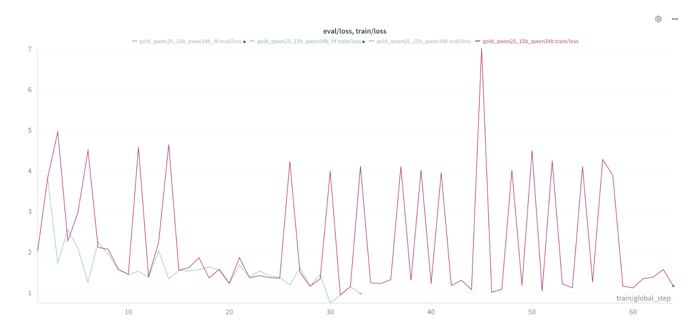
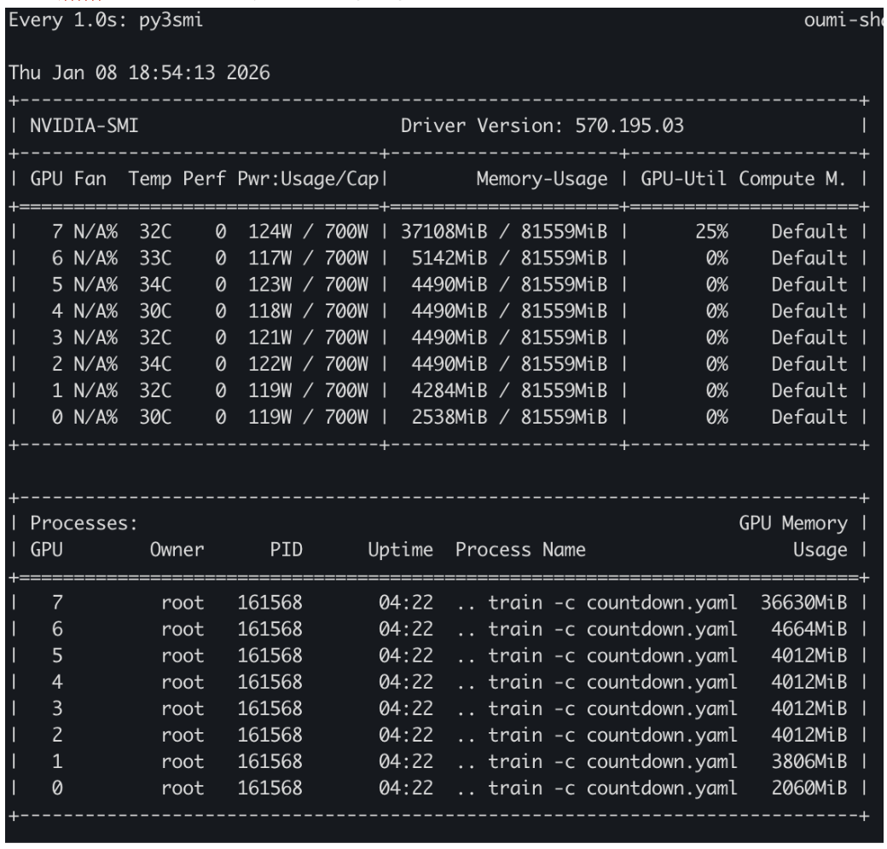
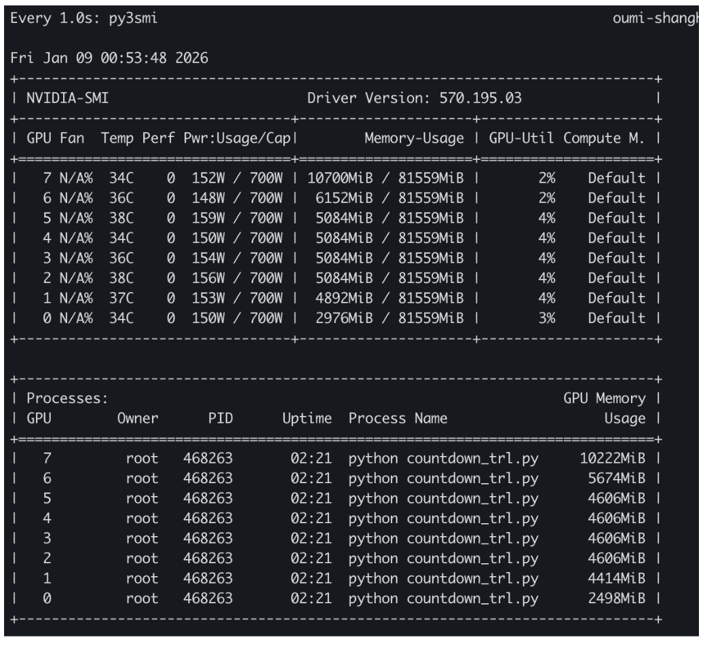
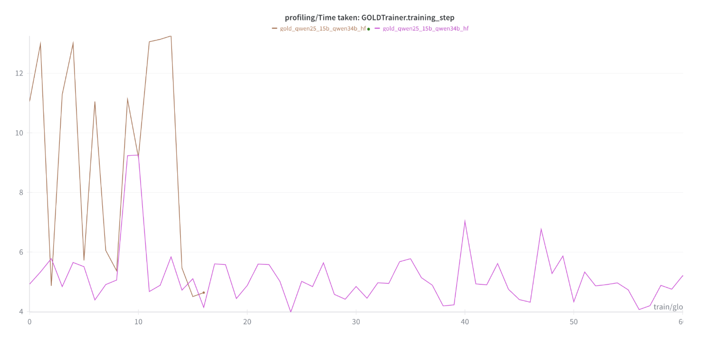

# Countdown task

Repro https://huggingface.co/spaces/HuggingFaceH4/on-policy-distillation

**Problem**: Losses from `GOLDTrainer` in native TRL vs Oumi are different



**Differences between the printed GOLDConfig** 
| HF                              | Oumi                             |
|---------------------------------|----------------------------------|
| bf16 = True                     | bf16 = False                     |
| eval_steps = None               | eval_steps = 100                 |
| gradient_checkpointing_kwargs = None | gradient_checkpointing_kwargs = {} |
| Misc naming differences         |                                  |

**Debug steps**:
- [ ] Check Trl version
- [ ] Check dataset loading
- [ ] Try with Accelerate to see if get any speedup
- [ ] Try without vllm
- [ ] Print GOLDConfig for both and compare

<details>
<summary>Oumi</summary>

    ```
    Output of hf_args = training_args.to_hf(training_config) and print(hf_args)
                
    GOLDConfig(
    _n_gpu=8,
    accelerator_config={'split_batches': False, 'dispatch_batches': None, 'even_batches': True, 'use_seedable_sampler': True, 'non_blocking': False, 'gradient_accumulation_kwargs': None, 'use_configured_state': False},
    activation_offloading=False,
    adafactor=False,
    adam_beta1=0.9,
    adam_beta2=0.999,
    adam_epsilon=1e-08,
    assistant_only_loss=False,
    auto_find_batch_size=False,
    average_tokens_across_devices=True,
    batch_eval_metrics=False,
    beta=0.0,
    bf16=False,
    bf16_full_eval=False,
    callbacks=[],
    chat_template_path=None,
    completion_only_loss=None,
    data_seed=42,
    dataloader_drop_last=False,
    dataloader_num_workers=0,
    dataloader_persistent_workers=False,
    dataloader_pin_memory=True,
    dataloader_prefetch_factor=None,
    dataset_kwargs=None,
    dataset_num_proc=None,
    dataset_text_field=text,
    ddp_backend=None,
    ddp_broadcast_buffers=None,
    ddp_bucket_cap_mb=None,
    ddp_find_unused_parameters=None,
    ddp_timeout=1800,
    debug=[],
    deepspeed=None,
    disable_dropout=True,
    disable_tqdm=False,
    do_eval=False,
    do_predict=False,
    do_train=False,
    eos_token=<EOS_TOKEN>,
    eval_accumulation_steps=None,
    eval_delay=0,
    eval_do_concat_batches=True,
    eval_on_start=False,
    eval_packing=None,
    eval_steps=100,
    eval_strategy=IntervalStrategy.NO,
    eval_use_gather_object=False,
    fp16=False,
    fp16_backend=auto,
    fp16_full_eval=False,
    fp16_opt_level=O1,
    fsdp=[],
    fsdp_config={'min_num_params': 0, 'xla': False, 'xla_fsdp_v2': False, 'xla_fsdp_grad_ckpt': False},
    fsdp_min_num_params=0,
    fsdp_transformer_layer_cls_to_wrap=None,
    full_determinism=False,
    gradient_accumulation_steps=2,
    gradient_checkpointing=True,
    gradient_checkpointing_kwargs={},
    greater_is_better=None,
    group_by_length=False,
    half_precision_backend=auto,
    hub_always_push=False,
    hub_model_id=None,
    hub_model_revision=main,
    hub_private_repo=None,
    hub_revision=None,
    hub_strategy=HubStrategy.EVERY_SAVE,
    hub_token=<HUB_TOKEN>,
    ignore_data_skip=False,
    include_for_metrics=[],
    include_inputs_for_metrics=False,
    include_num_input_tokens_seen=no,
    include_tokens_per_second=False,
    jit_mode_eval=False,
    label_names=None,
    label_smoothing_factor=0.0,
    learning_rate=1e-05,
    length_column_name=length,
    liger_kernel_config=None,
    lmbda=0.5,
    load_best_model_at_end=False,
    local_rank=0,
    log_completions=False,
    log_completions_steps=100,
    log_level=warning,
    log_level_replica=warning,
    log_on_each_node=True,
    logging_dir=output/gold_qwen25_15b_qwen34b/runs/Jan08_23-02-25_oumi-shanghongsim-55ccfb4f55-v5rxr,
    logging_first_step=True,
    logging_nan_inf_filter=True,
    logging_steps=1,
    logging_strategy=IntervalStrategy.STEPS,
    loss_type=nll,
    lr_scheduler_kwargs={},
    lr_scheduler_type=SchedulerType.COSINE,
    max_completion_length=256,
    max_grad_norm=1.0,
    max_length=4096,
    max_steps=-1,
    metric_for_best_model=None,
    model_init_kwargs=None,
    mp_parameters=,
    neftune_noise_alpha=None,
    no_cuda=False,
    num_completions_to_print=5,
    num_train_epochs=2,
    optim=OptimizerNames.ADAMW_TORCH,
    optim_args=None,
    optim_target_modules=None,
    output_dir=output/gold_qwen25_15b_qwen34b,
    overwrite_hub_revision=False,
    overwrite_output_dir=False,
    packing=False,
    packing_strategy=bfd,
    pad_to_multiple_of=None,
    pad_token=<PAD_TOKEN>,
    padding_free=False,
    parallelism_config=None,
    past_index=-1,
    per_device_eval_batch_size=2,
    per_device_train_batch_size=2,
    prediction_loss_only=False,
    project=huggingface,
    push_to_hub=False,
    push_to_hub_model_id=None,
    push_to_hub_organization=None,
    push_to_hub_revision=False,
    push_to_hub_token=<PUSH_TO_HUB_TOKEN>,
    ray_scope=last,
    remove_unused_columns=True,
    report_to=['wandb'],
    restore_callback_states_from_checkpoint=False,
    resume_from_checkpoint=None,
    run_name=gold_qwen25_15b_qwen34b,
    save_on_each_node=False,
    save_only_model=False,
    save_safetensors=True,
    save_steps=500,
    save_strategy=SaveStrategy.STEPS,
    save_total_limit=None,
    seed=42,
    seq_kd=False,
    shuffle_dataset=False,
    skip_memory_metrics=True,
    steps_per_generation=2,
    student_model_revision=main,
    teacher_model_init_kwargs={'torch_dtype': 'auto', 'dtype': 'auto', 'trust_remote_code': True, 'attn_implementation': 'kernels-community/vllm-flash-attn3', 'device_map': 'auto'},
    teacher_model_name_or_path=None,
    teacher_tokenizer_name_or_path=None,
    temperature=1.0,
    tf32=None,
    top_k=0,
    top_p=0.95,
    torch_compile=False,
    torch_compile_backend=None,
    torch_compile_mode=None,
    torch_empty_cache_steps=None,
    torchdynamo=None,
    tpu_metrics_debug=False,
    tpu_num_cores=None,
    trackio_space_id=trackio,
    trl_project=smollm3,
    uld_crossentropy_weight=0.0,
    uld_distillation_weight=1.0,
    uld_hybrid_matched_weight=None,
    uld_hybrid_unmatched_weight=None,
    uld_skip_student_eos=True,
    uld_skip_teacher_eos=True,
    uld_student_temperature=1.0,
    uld_teacher_temperature=1.0,
    uld_use_hybrid_loss=True,
    use_cpu=False,
    use_extended_uld=True,
    use_legacy_prediction_loop=False,
    use_liger_kernel=False,
    use_mps_device=False,
    use_transformers_paged=False,
    use_uld_loss=True,
    use_vllm=True,
    vllm_enable_sleep_mode=False,
    vllm_gpu_memory_utilization=0.4,
    vllm_guided_decoding_regex=None,
    vllm_mode=colocate,
    vllm_server_host=0.0.0.0,
    vllm_server_port=8001,
    vllm_server_timeout=240.0,
    vllm_sync_frequency=1,
    vllm_tensor_parallel_size=1,
    wandb_entity=None,
    wandb_log_unique_prompts=True,
    wandb_project=None,
    wandb_run_group=None,
    warmup_ratio=0.05,
    warmup_steps=0,
    weight_decay=0.0,
    )
    ```
</details>

<details>
<summary>Native TRL</summary>

    ```

        GOLDConfig(
        _n_gpu=8,
        accelerator_config={'split_batches': False, 'dispatch_batches': None, 'even_batches': True, 'use_seedable_sampler': True, 'non_blocking': False, 'gradient_accumulation_kwargs': None, 'use_configured_state': False},
        activation_offloading=False,
        adafactor=False,
        adam_beta1=0.9,
        adam_beta2=0.999,
        adam_epsilon=1e-08,
        assistant_only_loss=False,
        auto_find_batch_size=False,
        average_tokens_across_devices=True,
        batch_eval_metrics=False,
        beta=0.0,
        bf16=True,
        bf16_full_eval=False,
        callbacks=[],
        chat_template_path=None,
        completion_only_loss=None,
        data_seed=42,
        dataloader_drop_last=False,
        dataloader_num_workers=0,
        dataloader_persistent_workers=False,
        dataloader_pin_memory=True,
        dataloader_prefetch_factor=None,
        dataset_kwargs=None,
        dataset_num_proc=None,
        dataset_text_field=text,
        ddp_backend=None,
        ddp_broadcast_buffers=None,
        ddp_bucket_cap_mb=None,
        ddp_find_unused_parameters=None,
        ddp_timeout=1800,
        debug=[],
        deepspeed=None,
        disable_dropout=True,
        disable_tqdm=False,
        do_eval=False,
        do_predict=False,
        do_train=False,
        eos_token=<EOS_TOKEN>,
        eval_accumulation_steps=None,
        eval_delay=0,
        eval_do_concat_batches=True,
        eval_on_start=False,
        eval_packing=None,
        eval_steps=None,
        eval_strategy=IntervalStrategy.NO,
        eval_use_gather_object=False,
        fp16=False,
        fp16_backend=auto,
        fp16_full_eval=False,
        fp16_opt_level=O1,
        fsdp=[],
        fsdp_config={'min_num_params': 0, 'xla': False, 'xla_fsdp_v2': False, 'xla_fsdp_grad_ckpt': False},
        fsdp_min_num_params=0,
        fsdp_transformer_layer_cls_to_wrap=None,
        full_determinism=False,
        gradient_accumulation_steps=2,
        gradient_checkpointing=True,
        gradient_checkpointing_kwargs=None,
        greater_is_better=None,
        group_by_length=False,
        half_precision_backend=auto,
        hub_always_push=False,
        hub_model_id=None,
        hub_model_revision=main,
        hub_private_repo=None,
        hub_revision=None,
        hub_strategy=HubStrategy.EVERY_SAVE,
        hub_token=<HUB_TOKEN>,
        ignore_data_skip=False,
        include_for_metrics=[],
        include_inputs_for_metrics=False,
        include_num_input_tokens_seen=no,
        include_tokens_per_second=False,
        jit_mode_eval=False,
        label_names=None,
        label_smoothing_factor=0.0,
        learning_rate=1e-05,
        length_column_name=length,
        liger_kernel_config=None,
        lmbda=0.5,
        load_best_model_at_end=False,
        local_rank=0,
        log_completions=False,
        log_completions_steps=100,
        log_level=passive,
        log_level_replica=warning,
        log_on_each_node=True,
        logging_dir=output/gold_qwen25_15b_qwen34b_hf/runs/Jan09_00-01-34_oumi-shanghongsim-55ccfb4f55-v5rxr,
        logging_first_step=False,
        logging_nan_inf_filter=True,
        logging_steps=1,
        logging_strategy=IntervalStrategy.STEPS,
        loss_type=nll,
        lr_scheduler_kwargs=None,
        lr_scheduler_type=SchedulerType.COSINE,
        max_completion_length=256,
        max_grad_norm=1,
        max_length=4096,
        max_steps=-1,
        metric_for_best_model=None,
        model_init_kwargs=None,
        mp_parameters=,
        neftune_noise_alpha=None,
        no_cuda=False,
        num_completions_to_print=5,
        num_train_epochs=2,
        optim=OptimizerNames.ADAMW_TORCH,
        optim_args=None,
        optim_target_modules=None,
        output_dir=output/gold_qwen25_15b_qwen34b_hf,
        overwrite_hub_revision=False,
        overwrite_output_dir=False,
        packing=False,
        packing_strategy=bfd,
        pad_to_multiple_of=None,
        pad_token=<PAD_TOKEN>,
        padding_free=False,
        parallelism_config=None,
        past_index=-1,
        per_device_eval_batch_size=8,
        per_device_train_batch_size=2,
        prediction_loss_only=False,
        project=huggingface,
        push_to_hub=False,
        push_to_hub_model_id=None,
        push_to_hub_organization=None,
        push_to_hub_revision=False,
        push_to_hub_token=<PUSH_TO_HUB_TOKEN>,
        ray_scope=last,
        remove_unused_columns=True,
        report_to=['wandb'],
        restore_callback_states_from_checkpoint=False,
        resume_from_checkpoint=None,
        run_name=gold_qwen25_15b_qwen34b_hf,
        save_on_each_node=False,
        save_only_model=False,
        save_safetensors=True,
        save_steps=500,
        save_strategy=SaveStrategy.STEPS,
        save_total_limit=None,
        seed=42,
        seq_kd=False,
        shuffle_dataset=False,
        skip_memory_metrics=True,
        steps_per_generation=2,
        student_model_revision=main,
        teacher_model_init_kwargs={'torch_dtype': 'auto', 'dtype': 'auto', 'trust_remote_code': True, 'attn_implementation': 'kernels-community/vllm-flash-attn3', 'device_map': 'auto'},
        teacher_model_name_or_path=Qwen/Qwen3-4B-Instruct-2507,
        teacher_tokenizer_name_or_path=Qwen/Qwen3-4B-Instruct-2507,
        temperature=1.0,
        tf32=None,
        top_k=0,
        top_p=0.95,
        torch_compile=False,
        torch_compile_backend=None,
        torch_compile_mode=None,
        torch_empty_cache_steps=None,
        torchdynamo=None,
        tpu_metrics_debug=False,
        tpu_num_cores=None,
        trackio_space_id=trackio,
        trl_project=smollm3,
        uld_crossentropy_weight=0.0,
        uld_distillation_weight=1.0,
        uld_hybrid_matched_weight=None,
        uld_hybrid_unmatched_weight=None,
        uld_skip_student_eos=True,
        uld_skip_teacher_eos=True,
        uld_student_temperature=1.0,
        uld_teacher_temperature=1.0,
        uld_use_hybrid_loss=True,
        use_cpu=False,
        use_extended_uld=True,
        use_legacy_prediction_loop=False,
        use_liger_kernel=False,
        use_mps_device=False,
        use_transformers_paged=False,
        use_uld_loss=True,
        use_vllm=True,
        vllm_enable_sleep_mode=False,
        vllm_gpu_memory_utilization=0.4,
        vllm_guided_decoding_regex=None,
        vllm_mode=colocate,
        vllm_server_host=0.0.0.0,
        vllm_server_port=8001,
        vllm_server_timeout=240.0,
        vllm_sync_frequency=1,
        vllm_tensor_parallel_size=1,
        wandb_entity=None,
        wandb_log_unique_prompts=True,
        wandb_project=None,
        wandb_run_group=None,
        warmup_ratio=0.05,
        warmup_steps=0,
        weight_decay=0.0,
        )
    ```
</details>


**Solved** by setting `--bf16` (`mixed_precision_training`)

Note: In Oumi config, I needed to load student in `fp32` to enable `mixed_precision_training` 

```
  File "/opt/conda/envs/oumi/lib/python3.11/site-packages/omegaconf/omegaconf.py", line 607, in to_object
    return OmegaConf.to_container(
           ^^^^^^^^^^^^^^^^^^^^^^^
  File "/opt/conda/envs/oumi/lib/python3.11/site-packages/omegaconf/omegaconf.py", line 586, in to_container
    return BaseContainer._to_content(
           ^^^^^^^^^^^^^^^^^^^^^^^^^^
  File "/opt/conda/envs/oumi/lib/python3.11/site-packages/omegaconf/basecontainer.py", line 281, in _to_content
    return conf._to_object()
           ^^^^^^^^^^^^^^^^^
  File "/opt/conda/envs/oumi/lib/python3.11/site-packages/omegaconf/dictconfig.py", line 762, in _to_object
    result = object_type(**init_field_items)
             ^^^^^^^^^^^^^^^^^^^^^^^^^^^^^^^
  File "<string>", line 9, in __init__
  File "/data/shanghong/oumi/src/oumi/core/configs/training_config.py", line 138, in __post_init__
    raise ValueError(
ValueError: Model must be loaded in fp32 to enable mixed precision training.
```

## Efficiency

With `vllm` enabled, script seems to only be using 1 gpu



Disabling `vllm`


Observations:
- Disabling vllm seems to make it use the other 7 gpus more but rank 0 still dominates
- Unfortunately it still is faster with vllm, despite the unoptimal GPU utilization




Tried to add vllm to accelerate:
- Accelerate does not play nicely with vllm at the moment
- Native hf inference + accelerate (~19s/it) still 2x slower than vllm + no accelerate (~11s/it)

```
# accelerate launch train_gold_trl.py

from datasets import load_dataset
from trl.experimental.gold import GOLDConfig, GOLDTrainer
from transformers import AutoModelForCausalLM, AutoTokenizer

student_name = "Qwen/Qwen2.5-1.5B-Instruct"
teacher_name = "Qwen/Qwen3-4B-Instruct-2507"

tokenizer = AutoTokenizer.from_pretrained(student_name, use_fast=True)
if tokenizer.pad_token is None:
    tokenizer.pad_token = tokenizer.eos_token

train_dataset = load_dataset(
    "json",
    data_files="/data/shanghong/oumi/gold/data/train_small_128.jsonl",
    split="train",
)

training_args = GOLDConfig(
    max_length=4096,
    output_dir="output/gold_qwen25_15b_qwen34b_hf_accelerate",
    run_name="gold_qwen25_15b_qwen34b_hf_accelerate",
    num_train_epochs=5,
    per_device_train_batch_size=2,
    gradient_accumulation_steps=2,
    max_grad_norm=1,
    optim="adamw_torch",
    learning_rate=1.0e-05,
    lr_scheduler_type="cosine",
    warmup_ratio=0.05,
    logging_steps=1,
    report_to="wandb",

    bf16=True,

    teacher_model_name_or_path=teacher_name,
    teacher_tokenizer_name_or_path=teacher_name,
    teacher_model_init_kwargs={
        "torch_dtype": "auto",
        "trust_remote_code": True,

        # IMPORTANT: remove device_map for DDP
        "device_map": None,

        "attn_implementation": "kernels-community/vllm-flash-attn3",
    },

    temperature=1.0,
    max_completion_length=256,
    lmbda=0.5,
    beta=0.0,
    disable_dropout=True,
    seq_kd=False,
    use_uld_loss=True,
    uld_use_hybrid_loss=True,

    data_seed=42,
    use_vllm=True,
    vllm_mode="colocate",
    vllm_gpu_memory_utilization=0.4,
)

student_model = AutoModelForCausalLM.from_pretrained(
    student_name,
    torch_dtype="bfloat16",
    trust_remote_code=True,
    attn_implementation="sdpa",
    # IMPORTANT: remove device_map for DDP
    device_map=None,
)

trainer = GOLDTrainer(
    model=student_model,
    args=training_args,
    teacher_model=teacher_name,
    processing_class=tokenizer,
    train_dataset=train_dataset,
)

trainer.train()
```

## Results

| Model                     | Correct | Accuracy | Missing Answer Tags | Eqn Not Balanced | Invalid Number Usage | LHS Parse/Eval Error | RHS Parse/Eval Error | Wrong Value |
|---------------------------|---------|----------|---------------------|------------------|----------------------|----------------------|----------------------|-------------|
| qwen2.5_7b_baseline       | 3336    | 0.3336   | 2408                | 2186             | 2013                 | 52                   | 2                    | 3           |
| qwen2.5_1.5b_baseline     | 1264    | 0.1264   | 3997                | 2295             | 2291                 | 112                  | 8                    | 33          |
| qwen2.5_1.5b_ckpt500      | 5394    | 0.5394   | 4329                | 91               | 156                  | 13                   | 0                    | 17          |
| qwen2.5_1.5b_ckpt1000     | 5807    | 0.5807   | 3924                | 129              | 112                  | 2                    | 0                    | 26          |
| qwen3_4b_baseline         | 7931    | 0.7931   | 1783                | 1                | 275                  | 6                    | 0                    | 4           |


qwen2.5_7b_baseline
```
Total: 10000
Correct: 3336
Accuracy: 0.333600

Failure breakdown:
  missing_answer_tags: 2408
  equation_not_balanced: 2186
  invalid_number_usage: 2013
  lhs_parse_or_eval_error: 52
  wrong_value: 3
  rhs_parse_or_eval_error: 2
```

qwen2.5_1.5b_baseline
```
Total: 10000
Correct: 1264
Accuracy: 0.126400

Failure breakdown:
  missing_answer_tags: 3997
  equation_not_balanced: 2295
  invalid_number_usage: 2291
  lhs_parse_or_eval_error: 112
  wrong_value: 33
  rhs_parse_or_eval_error: 8
```

qwen2.5_1.5b_ckpt500
```
Total: 10000
Correct: 5394
Accuracy: 0.539400

Failure breakdown:
  missing_answer_tags: 4329
  invalid_number_usage: 156
  equation_not_balanced: 91
  wrong_value: 17
  lhs_parse_or_eval_error: 13
```

qwen2.5_1.5b_ckpt1000
```
Total: 10000
Correct: 5807
Accuracy: 0.580700

Failure breakdown:
  missing_answer_tags: 3924
  equation_not_balanced: 129
  invalid_number_usage: 112
  wrong_value: 26
  lhs_parse_or_eval_error: 2
```

qwen3_4b_baseline
```
Total: 10000
Correct: 7931
Accuracy: 0.793100

Failure breakdown:
  missing_answer_tags: 1783
  invalid_number_usage: 275
  lhs_parse_or_eval_error: 6
  wrong_value: 4
  equation_not_balanced: 1
```