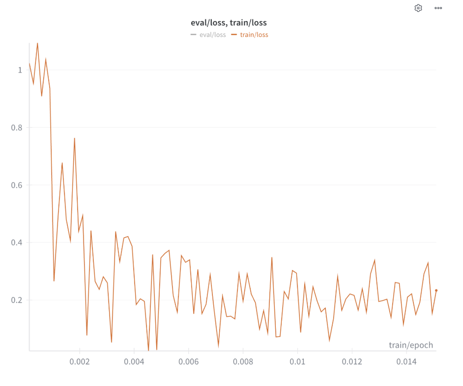
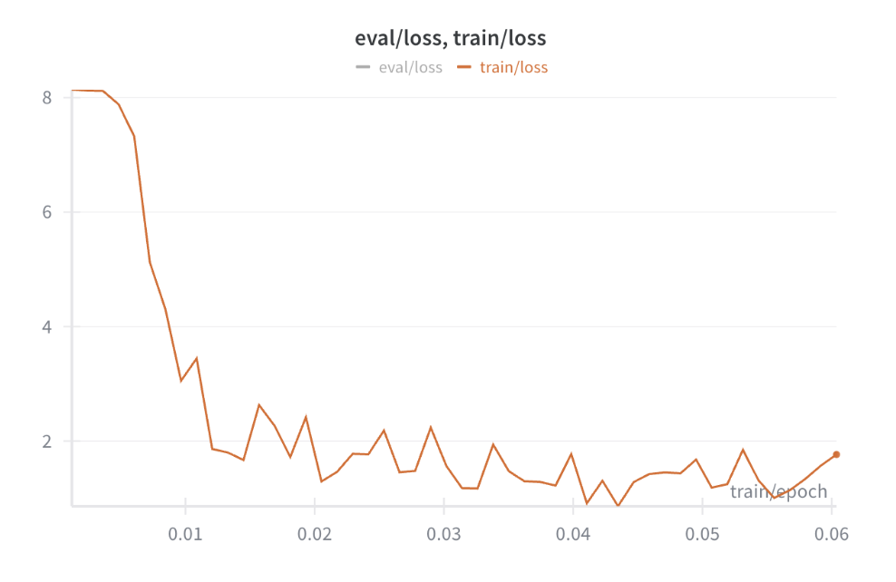
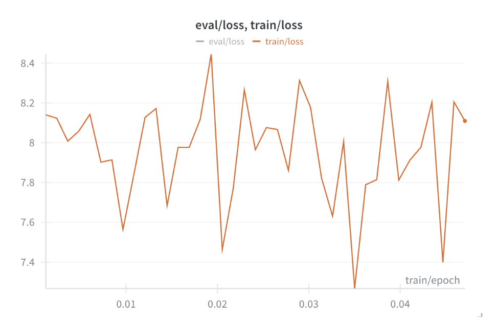
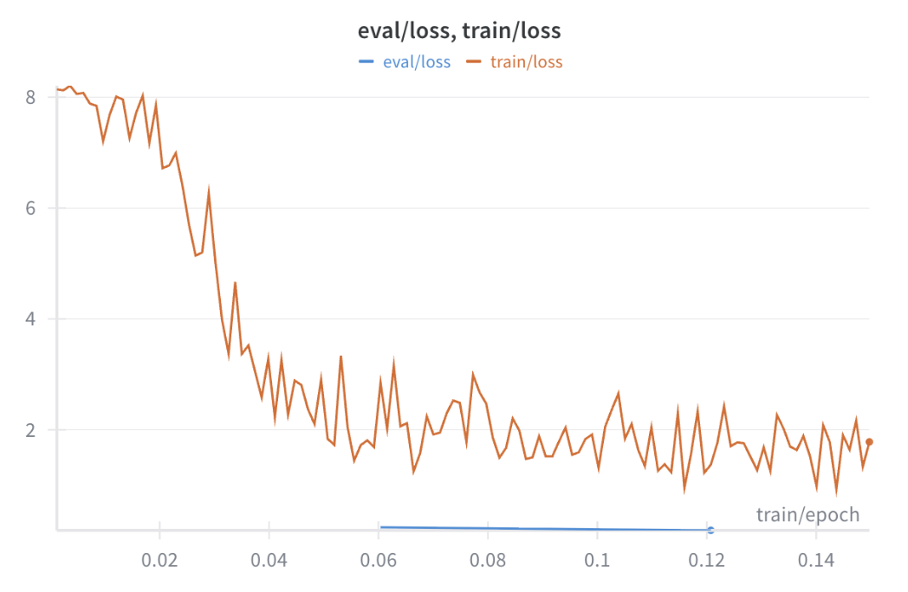
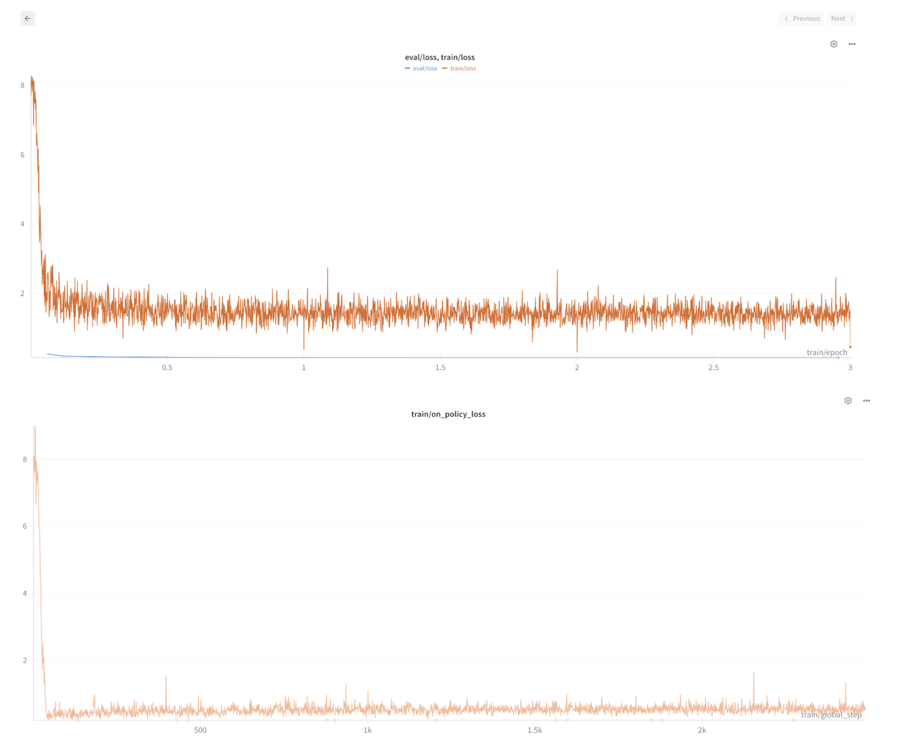
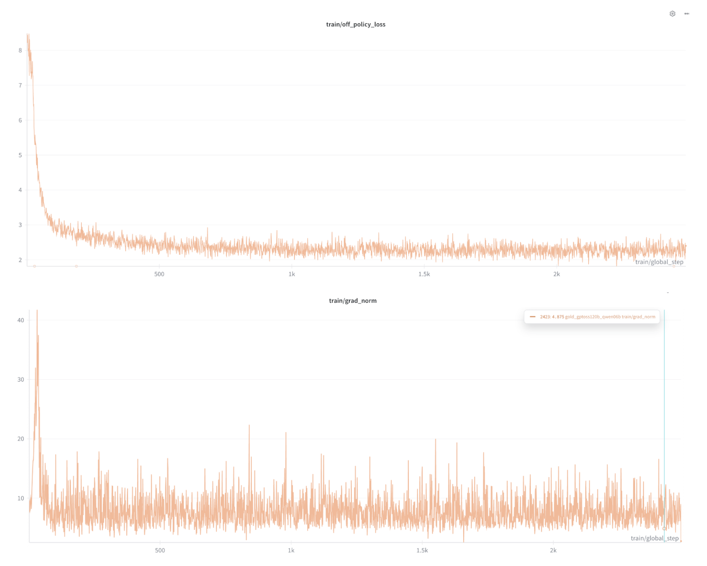

# Experiments on TATQA

## Experiment config

Ref: https://github.com/oumi-ai/oumi/blob/shanghong/gold/gold/gold.yaml 

Student: Qwen/Qwen3-0.6B
Teacher: openai/gpt-oss-120b
Data: Tatqa

Status
- [x] Test run with [original hparam](https://github.com/oumi-ai/oumi/blob/shanghong/gold/configs/examples/gold/train_gptoss120b_qwen06b.yaml)
- [ ] Tune hparam and run for 3 epochs


## Run 1
https://wandb.ai/shanghongsim/huggingface/runs/xpke25y7?nw=nwusershanghong_sim 

Test run (default hparam from Oumi repo): 



## Run 2
https://wandb.ai/shanghongsim/huggingface/runs/ied3451f?nw=nwusershanghong_sim

Changes: 
- Increased grad acc to 16

Notes:
- The initial loss increased from 1 to 8
- Loss became smoother



## Run 3
https://wandb.ai/shanghongsim/huggingface/runs/jq9m5yfe?nw=nwusershanghong_sim 

Changes:
- Decreased LR from 1e-04 to 1e-05
- changed warmup steps 10 to warmup ratio 0.1

Notes:
- Not converging loss, perhaps warming up for too long




## Run 4
Test: https://wandb.ai/shanghongsim/huggingface/runs/8vsr8f4g?nw=nwusershanghong_sim
Active run: https://wandb.ai/shanghongsim/huggingface/runs/ycg5t4c0?nw=nwusershanghong_sim 

Changes:
- Changed warmup ratio 0.1 to warmup steps 10

Notes: 
- On policy loss is converging to below 1 but off policy loss seems to be plateauing at 2-3





Output of heckpoint 250 (near 0.5 epoch, seen about 6k data samples):
On and off policy loss had converged by this point

```
{"content": {"request": "Context:\n9.4. Trade and other payables\n\nTrade payables are unsecured and are usually paid within 30 days of recognition. Other payables and accruals are paid when amounts fall due. The carrying amounts of trade and other payables are assumed to be the same as their fair values, due to their short-term nature.\n\nTables:\n|  | 2019 | 2018 |\n|  | $'000 | $'000 |\n| Current |  |  |\n| Trade payables | 3,486 | 4,184 |\n| Accrued expenses | 6,706 | 2,717 |\n| GST and employment taxes payable | 2,644 | 1,256 |\n| Other payables | 6,157 | 4,161 |\n| Total | 18,993 | 12,318 |\n\nQuestion:\nWhat is the change in GST and employment taxes payable from 2018 to 2019?", "response": " 2 the 2 the 2 the 2 the 2 the 2 the 2 the 2 the 2 the 2 the 2 the 2 the 2 the 2 the 2 the 2 the 2 the 2 the 2 the 2 the 2 the 2 the 2 the 2 the 2 the 2 the 2 the 2 the 2 the 2 the 2 the 2 the 2 the 2 the 2 the 2 the 2 the 2 the 2 the 2 the 2 the 2 the 2 the 2 the 2 the 2 the 2 the 2 the 2 the 2 the 2 the 2 the 2 the 2 the 2 the 2 the 2 the 2 the 2 the 2 the 2 the 2 the 2 the 2 the 2 the 2 the 2 the 2 the 2 the 2 the 2 the 2 the 2 the 2 the 2 the 2 the 2 the 2 the 2 the 2 the 2 the 2 the 2 the 2 the 2 the 2 the 2 the 2 the 2 the 2 the 2 the 2 the 2 the 2 the 2 the 2 the 2 the 2 the 2 the 2 the 2 the 2 the 2 the 2 the 2 the 2 the 2 the 2 the 2 the 2 the 2 the 2 the 2 the 2 the 2 the 2 the 2 the 2 the 2 the 2 the 2 the 2 the 2 the 2 the 2 the 2 the 2 the 2 the 2 the 2 the 2 the 2 the 2 the 2 the 2 the 2 the 2 the 2 the 2 the 2 the 2 the 2 the 2 the 2 the 2 the 2 the 2 the 2 the 2 the 2 the 2 the 2 the 2 the 2 the 2 the 2 the 2 the 2 the 2 the 2 the 2 the 2....
```
Observations:
- Eval loss (~0.1) < train loss (~1.6)
- Train loss seems to converge before 0.5 epoch
- On policy loss converged to around 0.5
- Off policy loss converged to around 2
- Both had a couple of NaNs -> unstable training
- Grad norm was very high and spiky throughout

Notes:
- Lambda: weighting between the dataset and self sampling
- Temperature: higher is more random

Questions:
- Is short gold max model len causing the on policy to be very easy hence the low loss?
    - No. Unlikely
- Why is use_uld_loss set to False explicitly? ([ref](https://github.com/oumi-ai/oumi/blob/63b0eb8a5b9ef5256671cede817cf9b4d2244fe5/configs/examples/gold/train_gptoss120b_qwen06b.yaml#L92))
- How does more epochs with constant LR affect training dynamics?
- Can higher LR with less epochs replicate the results of low LR and many epochs?

Community commenter
```
I conducted the training using 4 A800 GPUs with the LLaMAFactory framework. Below are my training parameters:
{"cutoff_len":5120,"learning_rate":0.0001,"gradient_accumulation_steps":1,"zero_stage":2,"num_train_epochs":1,"tuning_type":"full","model_name":"Qwen/Qwen2.5-1.5B-Instruct","stage":"sft","per_device_train_batch_size":8,"logging_steps":10}
```

Original authors’ hparams
```
TLDR: our hyperparameters are listed below, but the most important is the learning rate.

learning_rate: We used 1e-7.
lr_scheduler_type: 'cosine'
num_train_epochs: 5
Effective batch size (EBS): 32.
```

Meta observations:
- Increased grad acc caused loss to increase 8x
- Dropping LR and max_grad_norm did not really help

To do:
- [x] Review how on policy distillation works

Debugging steps:
- 🚧Align dataset and teacher. Currently the dataset is distilled from gpt5 mini and teacher is gpt oss
- ✅Try student and teacher from same family to eliminate tokenization mismatch 
- Fix a few hparams:
    - use_uld_loss: True
    - uld_use_hybrid_loss: True
    - Use collator for completions only

```
collator_name: "text_completions_only_with_padding"
collator_kwargs:
response_template: "<|im_start|>assistant\n"
       instruction_template: "<|im_start|>user\n"
```


| Name          | Changes                                                                                                                                                                                                 | Effect                                                                 |
|---------------|---------------------------------------------------------------------------------------------------------------------------------------------------------------------------------------------------------|------------------------------------------------------------------------|
|               | **General changes for debug**<br>- Teacher qwen3 32b<br>- Decrease LR from 1.0e-04 to 1.0e-05<br>- Increased model max len from 2048 to 4096<br>- Changed data<br>- Add max grad norm 1              |                                                                        |
| Debug run 1   | **Changed from original**<br>- Grad acc 16 (2 → 16)<br>- Lambda 0 (full off policy)<br>- use_uld_loss = **true** (was false)                                                                          | Loss started at 0.8 which is suspiciously low \*needs investigation   |
| Debug run 2   | **Same as debug run 1**<br>- Grad acc 2<br>- Lambda 0.5<br>- use_uld_loss = **false**                                                                                                                   | Loss started at 1.1, might be because of the small grad acc?           |
| Debug run 3   | **Same as debug run 2**<br>- Grad acc 16 (2 → 16)<br>- Lambda 0.5<br>- use_uld_loss = **false**                                                                                                          | Loss start at 8<br>Very big grad norm (30)                              |
| Debug run 4   | **Same as debug run 2**<br>- Grad acc 16 (2 → 16)<br>- Lambda 0.5<br>- use_uld_loss = **true**                                                                                                           | Loss start at 4                                                         |


Observations:
- Setting use_uld_loss = true cuts loss (run 3 vs 4)
- Increasing grad acc increases loss (run 2 vs 3)
- Complete off policy just looks wrong

Issues:
- Completions only collator not compatible with GOLD trainer
    - From GOLDTrainer page: GOLDTrainer keeps the raw messages so the ChatML collator can construct prompts and completions with the correct boundaries.
    - How is collator being passed in for Oumi? https://github.com/oumi-ai/oumi/blob/63b0eb8a5b9ef5256671cede817cf9b4d2244fe5/src/oumi/builders/training.py#L71 
    - How is collator passed in natively for HF? https://huggingface.co/docs/trl/en/gold_trainer#trl.experimental.gold.GOLDTrainer 
    - ** needs more investigation 

Next debugging steps:
- Try to repro results here: https://huggingface.co/spaces/HuggingFaceH4/on-policy-distillation 
- Use their settings for our scenario (Tatqa)


## Bugs

<details>
<summary>When trying to use `text_completions_only_with_padding` collator in Oumi</summary>
    
    ```
    wandb: Currently logged in as: shanghong_sim (shanghongsim) to https://api.wandb.ai. Use `wandb login --relogin` to force relogin
    wandb: Tracking run with wandb version 0.23.1
    wandb: Run data is saved locally in /data/shanghong/oumi/wandb/run-20260107_020650-7mcxh0rt
    wandb: Run `wandb offline` to turn off syncing.
    wandb: Syncing run gold_qwen32b_qwen06b_debug
    wandb: __ View project at https://wandb.ai/shanghongsim/huggingface
    wandb: __ View run at https://wandb.ai/shanghongsim/huggingface/runs/7mcxh0rt
    wandb: Detected [openai] in use.
    wandb: Use W&B Weave for improved LLM call tracing. Install Weave with `pip install weave` then add `import weave` to the top of your script.
    wandb: For more information, check out the docs at: https://weave-docs.wandb.ai/
    0%|                                                                                                        | 0/829 [00:00<?, ?it/s]
    File "/data/shanghong/oumi/src/oumi/cli/main.py", line 328, in run
        return app()
            ^^^^^
    File "/opt/conda/envs/oumi/lib/python3.11/site-packages/typer/main.py", line 336, in __call__
        raise e
    File "/opt/conda/envs/oumi/lib/python3.11/site-packages/typer/main.py", line 319, in __call__
        return get_command(self)(*args, **kwargs)
            ^^^^^^^^^^^^^^^^^^^^^^^^^^^^^^^^^^
    File "/opt/conda/envs/oumi/lib/python3.11/site-packages/click/core.py", line 1161, in __call__
        return self.main(*args, **kwargs)
            ^^^^^^^^^^^^^^^^^^^^^^^^^^
    File "/opt/conda/envs/oumi/lib/python3.11/site-packages/typer/core.py", line 803, in main
        return _main(
            ^^^^^^
    File "/opt/conda/envs/oumi/lib/python3.11/site-packages/typer/core.py", line 189, in _main
        rv = self.invoke(ctx)
            ^^^^^^^^^^^^^^^^
    File "/opt/conda/envs/oumi/lib/python3.11/site-packages/click/core.py", line 1697, in invoke
        return _process_result(sub_ctx.command.invoke(sub_ctx))
                            ^^^^^^^^^^^^^^^^^^^^^^^^^^^^^^^
    File "/opt/conda/envs/oumi/lib/python3.11/site-packages/click/core.py", line 1443, in invoke
        return ctx.invoke(self.callback, **ctx.params)
            ^^^^^^^^^^^^^^^^^^^^^^^^^^^^^^^^^^^^^^^
    File "/opt/conda/envs/oumi/lib/python3.11/site-packages/click/core.py", line 788, in invoke
        return __callback(*args, **kwargs)
            ^^^^^^^^^^^^^^^^^^^^^^^^^^^
    File "/opt/conda/envs/oumi/lib/python3.11/site-packages/typer/main.py", line 706, in wrapper
        return callback(**use_params)
            ^^^^^^^^^^^^^^^^^^^^^^
    File "/data/shanghong/oumi/src/oumi/cli/train.py", line 226, in train
        oumi_train(parsed_config, verbose=verbose)
    File "/data/shanghong/oumi/src/oumi/__init__.py", line 270, in train
        return oumi.train.train(
            ^^^^^^^^^^^^^^^^^
    File "/data/shanghong/oumi/src/oumi/train.py", line 570, in train
        trainer.train(resume_from_checkpoint=checkpoint_location)
    File "/data/shanghong/oumi/src/oumi/core/trainers/hf_trainer.py", line 41, in train
        self._hf_trainer.train(resume_from_checkpoint=resume_from_checkpoint)
    File "/opt/conda/envs/oumi/lib/python3.11/site-packages/transformers/trainer.py", line 2325, in train
        return inner_training_loop(
            ^^^^^^^^^^^^^^^^^^^^
    File "/opt/conda/envs/oumi/lib/python3.11/site-packages/transformers/trainer.py", line 2618, in _inner_training_loop
        batch_samples, num_items_in_batch = self.get_batch_samples(epoch_iterator, num_batches, args.device)
                                            ^^^^^^^^^^^^^^^^^^^^^^^^^^^^^^^^^^^^^^^^^^^^^^^^^^^^^^^^^^^^^^^^
    File "/opt/conda/envs/oumi/lib/python3.11/site-packages/transformers/trainer.py", line 5654, in get_batch_samples
        batch_samples.append(next(epoch_iterator))
                            ^^^^^^^^^^^^^^^^^^^^
    File "/opt/conda/envs/oumi/lib/python3.11/site-packages/accelerate/data_loader.py", line 567, in __iter__
        current_batch = next(dataloader_iter)
                        ^^^^^^^^^^^^^^^^^^^^^
    File "/opt/conda/envs/oumi/lib/python3.11/site-packages/torch/utils/data/dataloader.py", line 734, in __next__
        data = self._next_data()
            ^^^^^^^^^^^^^^^^^
    File "/opt/conda/envs/oumi/lib/python3.11/site-packages/torch/utils/data/dataloader.py", line 790, in _next_data
        data = self._dataset_fetcher.fetch(index)  # may raise StopIteration
            ^^^^^^^^^^^^^^^^^^^^^^^^^^^^^^^^^^
    File "/opt/conda/envs/oumi/lib/python3.11/site-packages/torch/utils/data/_utils/fetch.py", line 55, in fetch
        return self.collate_fn(data)
            ^^^^^^^^^^^^^^^^^^^^^
    File "/data/shanghong/oumi/src/oumi/core/collators/text_completions_collator_with_padding.py", line 75, in __call__
        collated_text_inputs = self._collate(batch)
                            ^^^^^^^^^^^^^^^^^^^^
    File "/data/shanghong/oumi/src/oumi/core/collators/text_completions_collator_with_padding.py", line 55, in _collate
        result = self._default_collator(inputs)
                ^^^^^^^^^^^^^^^^^^^^^^^^^^^^^^
    File "/opt/conda/envs/oumi/lib/python3.11/site-packages/transformers/data/data_collator.py", line 45, in __call__
        return self.torch_call(features)
            ^^^^^^^^^^^^^^^^^^^^^^^^^
    File "/data/shanghong/oumi/src/oumi/core/collators/trl_data_collator_for_completion_only_lm.py", line 85, in torch_call
        batch = super().torch_call(examples)
                ^^^^^^^^^^^^^^^^^^^^^^^^^^^^
    File "/opt/conda/envs/oumi/lib/python3.11/site-packages/transformers/data/data_collator.py", line 1033, in torch_call
        batch = pad_without_fast_tokenizer_warning(
                ^^^^^^^^^^^^^^^^^^^^^^^^^^^^^^^^^^^
    File "/opt/conda/envs/oumi/lib/python3.11/site-packages/transformers/data/data_collator.py", line 66, in
    pad_without_fast_tokenizer_warning
        padded = tokenizer.pad(*pad_args, **pad_kwargs)
                ^^^^^^^^^^^^^^^^^^^^^^^^^^^^^^^^^^^^^^
    File "/opt/conda/envs/oumi/lib/python3.11/site-packages/transformers/tokenization_utils_base.py", line 3592, in pad
        return BatchEncoding(batch_outputs, tensor_type=return_tensors)
            ^^^^^^^^^^^^^^^^^^^^^^^^^^^^^^^^^^^^^^^^^^^^^^^^^^^^^^^^
    File "/opt/conda/envs/oumi/lib/python3.11/site-packages/transformers/tokenization_utils_base.py", line 249, in __init__
        self.convert_to_tensors(tensor_type=tensor_type, prepend_batch_axis=prepend_batch_axis)
    File "/opt/conda/envs/oumi/lib/python3.11/site-packages/transformers/tokenization_utils_base.py", line 812, in convert_to_tensors
        raise ValueError(
    ValueError: Unable to create tensor, you should probably activate truncation and/or padding with 'padding=True' 'truncation=True' to
    have batched tensors with the same length. Perhaps your features (`messages` in this case) have excessive nesting (inputs type `list`
    where type `int` is expected).

    ```
</details>


<details>
  <summary>when using `oumi distributed` with `GOLDTrainer`</summary>

    ```
    ### oumi distributed torchrun -m oumi train -c countdown.yaml | tee train_countdown.log
    Traceback (most recent call last):
    File "/data/shanghong/oumi/src/oumi/cli/main.py", line 328, in run
        return app()
            ^^^^^
    File "/opt/conda/envs/oumi/lib/python3.11/site-packages/typer/main.py", line 336, in __call__
        raise e
    File "/opt/conda/envs/oumi/lib/python3.11/site-packages/typer/main.py", line 319, in __call__
        return get_command(self)(*args, **kwargs)
            ^^^^^^^^^^^^^^^^^^^^^^^^^^^^^^^^^^
    File "/opt/conda/envs/oumi/lib/python3.11/site-packages/click/core.py", line 1161, in __call__
        return self.main(*args, **kwargs)
            ^^^^^^^^^^^^^^^^^^^^^^^^^^
    File "/opt/conda/envs/oumi/lib/python3.11/site-packages/typer/core.py", line 803, in main
        return _main(
            ^^^^^^
    File "/opt/conda/envs/oumi/lib/python3.11/site-packages/typer/core.py", line 189, in _main
        rv = self.invoke(ctx)
            ^^^^^^^^^^^^^^^^
    File "/opt/conda/envs/oumi/lib/python3.11/site-packages/click/core.py", line 1697, in invoke
        return _process_result(sub_ctx.command.invoke(sub_ctx))
                            ^^^^^^^^^^^^^^^^^^^^^^^^^^^^^^^
    File "/opt/conda/envs/oumi/lib/python3.11/site-packages/click/core.py", line 1443, in invoke
        return ctx.invoke(self.callback, **ctx.params)
            ^^^^^^^^^^^^^^^^^^^^^^^^^^^^^^^^^^^^^^^
    File "/opt/conda/envs/oumi/lib/python3.11/site-packages/click/core.py", line 788, in invoke
        return __callback(*args, **kwargs)
            ^^^^^^^^^^^^^^^^^^^^^^^^^^^
    File "/opt/conda/envs/oumi/lib/python3.11/site-packages/typer/main.py", line 706, in wrapper
        return callback(**use_params)
            ^^^^^^^^^^^^^^^^^^^^^^
    File "/data/shanghong/oumi/src/oumi/cli/train.py", line 226, in train
        oumi_train(parsed_config, verbose=verbose)
    File "/data/shanghong/oumi/src/oumi/__init__.py", line 270, in train
        return oumi.train.train(
            ^^^^^^^^^^^^^^^^^
    File "/data/shanghong/oumi/src/oumi/train.py", line 523, in train
        trainer = create_trainer_fn(
                ^^^^^^^^^^^^^^^^^^
    File "/data/shanghong/oumi/src/oumi/builders/training.py", line 71, in _init_hf_trainer
        trainer = HuggingFaceTrainer(cls(*args, **kwargs, args=hf_args), processor)
                                    ^^^^^^^^^^^^^^^^^^^^^^^^^^^^^^^^^^
    File "/opt/conda/envs/oumi/lib/python3.11/site-packages/trl/experimental/gold/gold_trainer.py", line 837, in __init__
        self.teacher_model = self.accelerator.prepare_model(teacher_model, evaluation_mode=True)
                            ^^^^^^^^^^^^^^^^^^^^^^^^^^^^^^^^^^^^^^^^^^^^^^^^^^^^^^^^^^^^^^^^^^^
    File "/opt/conda/envs/oumi/lib/python3.11/site-packages/accelerate/accelerator.py", line 1769, in prepare_model
        raise ValueError(
    ValueError: You can't train a model that has been loaded with `device_map='auto'` in any distributed mode. Please rerun your script
    specifying `--num_processes=1` or by launching with `python {{myscript.py}}`.


    If you believe this is a bug, please file an issue:
    https://github.com/oumi-ai/oumi/issues/new?template=bug-report.yaml
    [rank0]:[W108 21:00:14.242582016 ProcessGroupNCCL.cpp:1538] Warning: WARNING: destroy_process_group() was not called before program exit, which can leak resources. For more info, please see https://pytorch.org/docs/stable/distributed.html#shutdown (function operator())
    W0108 21:00:16.060000 243805 site-packages/torch/distributed/elastic/multiprocessing/api.py:900] Sending process 243874 closing signal SIGTERM
    W0108 21:00:16.060000 243805 site-packages/torch/distributed/elastic/multiprocessing/api.py:900] Sending process 243875 closing signal SIGTERM
    W0108 21:00:16.060000 243805 site-packages/torch/distributed/elastic/multiprocessing/api.py:900] Sending process 243876 closing signal SIGTERM
    W0108 21:00:16.060000 243805 site-packages/torch/distributed/elastic/multiprocessing/api.py:900] Sending process 243877 closing signal SIGTERM
    W0108 21:00:16.061000 243805 site-packages/torch/distributed/elastic/multiprocessing/api.py:900] Sending process 243878 closing signal SIGTERM
    W0108 21:00:16.061000 243805 site-packages/torch/distributed/elastic/multiprocessing/api.py:900] Sending process 243879 closing signal SIGTERM
    W0108 21:00:16.061000 243805 site-packages/torch/distributed/elastic/multiprocessing/api.py:900] Sending process 243881 closing signal SIGTERM
    E0108 21:00:20.660000 243805 site-packages/torch/distributed/elastic/multiprocessing/api.py:874] failed (exitcode: 1) local_rank: 6 (pid: 243880) of binary: /opt/conda/envs/oumi/bin/python3.11
    Traceback (most recent call last):
    File "/opt/conda/envs/oumi/bin/torchrun", line 7, in <module>

    ```

</details>


<details>
  <summary>Setting `vllm_tensor_parallel_size: 8`</summary>

    ```
    Traceback (most recent call last):
    File "/data/shanghong/oumi/src/oumi/cli/main.py", line 328, in run
        return app()
            ^^^^^
    File "/opt/conda/envs/oumi/lib/python3.11/site-packages/typer/main.py", line 336, in __call__
        raise e
    File "/opt/conda/envs/oumi/lib/python3.11/site-packages/typer/main.py", line 319, in __call__
        return get_command(self)(*args, **kwargs)
            ^^^^^^^^^^^^^^^^^^^^^^^^^^^^^^^^^^
    File "/opt/conda/envs/oumi/lib/python3.11/site-packages/click/core.py", line 1161, in __call__
        return self.main(*args, **kwargs)
            ^^^^^^^^^^^^^^^^^^^^^^^^^^
    File "/opt/conda/envs/oumi/lib/python3.11/site-packages/typer/core.py", line 803, in main
        return _main(
            ^^^^^^
    File "/opt/conda/envs/oumi/lib/python3.11/site-packages/typer/core.py", line 189, in _main
        rv = self.invoke(ctx)
            ^^^^^^^^^^^^^^^^
    File "/opt/conda/envs/oumi/lib/python3.11/site-packages/click/core.py", line 1697, in invoke
        return _process_result(sub_ctx.command.invoke(sub_ctx))
                            ^^^^^^^^^^^^^^^^^^^^^^^^^^^^^^^
    File "/opt/conda/envs/oumi/lib/python3.11/site-packages/click/core.py", line 1443, in invoke
        return ctx.invoke(self.callback, **ctx.params)
            ^^^^^^^^^^^^^^^^^^^^^^^^^^^^^^^^^^^^^^^
    File "/opt/conda/envs/oumi/lib/python3.11/site-packages/click/core.py", line 788, in invoke
        return __callback(*args, **kwargs)
            ^^^^^^^^^^^^^^^^^^^^^^^^^^^
    File "/opt/conda/envs/oumi/lib/python3.11/site-packages/typer/main.py", line 706, in wrapper
        return callback(**use_params)
            ^^^^^^^^^^^^^^^^^^^^^^
    File "/data/shanghong/oumi/src/oumi/cli/train.py", line 226, in train
        oumi_train(parsed_config, verbose=verbose)
    File "/data/shanghong/oumi/src/oumi/__init__.py", line 270, in train
        return oumi.train.train(
            ^^^^^^^^^^^^^^^^^
    File "/data/shanghong/oumi/src/oumi/train.py", line 523, in train
        trainer = create_trainer_fn(
                ^^^^^^^^^^^^^^^^^^
    File "/data/shanghong/oumi/src/oumi/builders/training.py", line 71, in _init_hf_trainer
        trainer = HuggingFaceTrainer(cls(*args, **kwargs, args=hf_args), processor)
                                    ^^^^^^^^^^^^^^^^^^^^^^^^^^^^^^^^^^
    File "/opt/conda/envs/oumi/lib/python3.11/site-packages/trl/experimental/gold/gold_trainer.py", line 925, in __init__
        raise ValueError(
    ValueError: vllm_tensor_parallel_size (8) must divide world size (1) evenly.

    ```

</details>


<details>
  <summary>Data collation is handled by GOLD</summary>

    ```
    File "/opt/conda/envs/oumi_trl/lib/python3.11/site-packages/trl/experimental/gold/gold_trainer.py", line 766, in __init__
        data_collator = DataCollatorForChatML(tokenizer=processing_class, max_length=args.max_length)
                        ^^^^^^^^^^^^^^^^^^^^^^^^^^^^^^^^^^^^^^^^^^^^^^^^^^^^^^^^^^^^^^^^^^^^^^^^^^^^^
    ```
</details>


